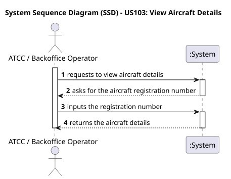
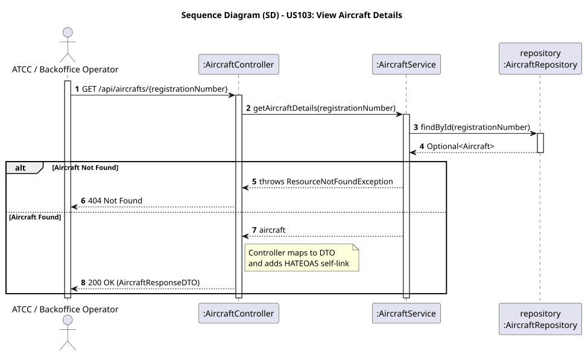

# US103 - View Aircraft Details

## User Story
> As an ATCC or Backoffice Operator, I want to retrieve and view the specific details of a registered aircraft using its registration number.

## Acceptance Criteria
- The request must provide the aircraft's `registrationNumber` as a path variable.
- On success, the system returns HTTP 200 OK with the aircraft details and HATEOAS links.

## Pre-conditions
- The actor is authenticated as either an `ATCC` or a `BACKOFFICE_OPERATOR`.

## Post-conditions
- None (Read-only operation).

## Main Success Scenario
1. The actor sends a `GET /api/aircrafts/{registrationNumber}` request.
2. The system queries the repository for the specific aircraft.
3. The system maps the found entity to a Response DTO.
4. The system appends HATEOAS self-links to the DTO.
5. The system returns HTTP 200 OK with the payload.

## Alternative / Exception Flows
| Step | Condition | System Response |
|------|-----------|-----------------|
| 2 | The aircraft with the requested registration number does not exist | HTTP 404 Not Found |

## Design Justification
- **Robust Exception Handling:** Implemented proper HTTP status mapping (`ResourceNotFoundException` translated to a 404 response).
- **Flexible Authorization:** Leverages `@PreAuthorize("hasAnyRole(...)")` to allow cross-profile read access without duplicating endpoints.

## Sequence Diagrams

### System Sequence Diagram

### Sequence Diagram
