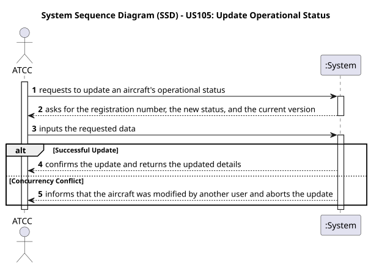
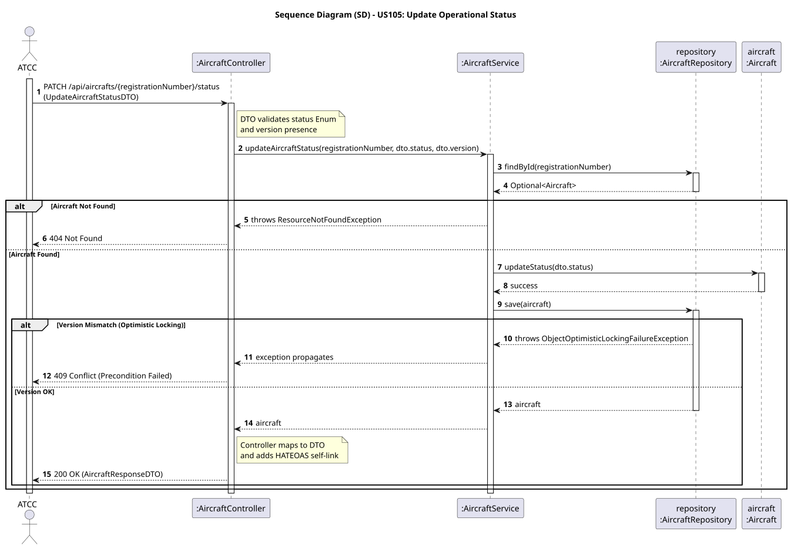

# US105 - Update Operational Status

## User Story
> As an ATCC, I want to update the operational status of an aircraft (e.g., from AVAILABLE to IN_FLIGHT).

## Acceptance Criteria
- The request must provide the new `status` and the current `version` of the aircraft record.
- The system must prevent concurrent lost updates if multiple users modify the same aircraft simultaneously.
- On success, the system returns HTTP 200 OK with the updated aircraft details and the incremented version.

## Pre-conditions
- The actor is authenticated as an `ATCC`.
- The aircraft must exist in the database.

## Post-conditions
- The `Aircraft` entity is updated with the new status.
- The aircraft's `@Version` is automatically incremented in the database.

## Main Success Scenario
1. The actor sends a `PATCH /api/aircrafts/{registrationNumber}/status` request with the new status and current version.
2. The system validates the new status against the allowed Enum values.
3. The system queries the database for the aircraft.
4. The system updates the status of the entity in memory.
5. The system saves the entity, successfully validating the version.
6. The system returns HTTP 200 OK with the updated DTO.

## Alternative / Exception Flows
| Step | Condition | System Response |
|------|-----------|-----------------|
| 2 | Invalid status or missing version in the payload | HTTP 400 Bad Request |
| 3 | The aircraft does not exist | HTTP 404 Not Found |
| 5 | The submitted version does not match the database version (Optimistic Locking conflict) | HTTP 409 Conflict (Precondition Failed) |

## Design Justification
- **Concurrency Control:** Designed with **Optimistic Locking** (`@Version` annotation in JPA). This ensures that concurrent ATCCs do not silently overwrite each other's status updates without requiring heavy database locks.
- **REST Best Practices:** Uses the `PATCH` HTTP method, which is semantically correct for partial entity updates.

## Sequence Diagrams

### System Sequence Diagram

### Sequence Diagram
