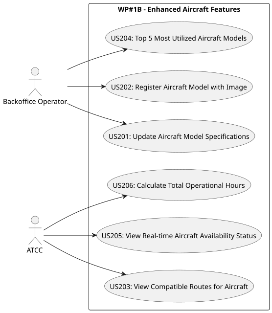

# Work Package #1B - Enhanced Aircraft Features

Welcome to the documentation folder for **Work Package #1B**.
This package contains the design diagrams, architectural justifications, and detailed descriptions for Phase 2 of the Aircraft Management context.

## User Stories

| ID | Story | Role | Link |
|:---|:---|:---:|:---:|
| **US201** | Update an aircraft model's specifications. | Backoffice Operator | [Read Documentation](US201/README.md) |
| **US202** | Register an aircraft model with an optional image. | Backoffice Operator | [Read Documentation](US202/README.md) |
| **US203** | View which routes are compatible with a specific aircraft. | ATCC | [Read Documentation](US203/README.md) |
| **US204** | Top 5 most utilized aircraft models (by hours/assignments). | Backoffice Operator | [Read Documentation](US204/README.md) |
| **US205** | View real-time aircraft availability status dashboard. | ATCC | [Read Documentation](US205/README.md) |
| **US206** | Calculate the total operational hours for each aircraft. | ATCC | [Read Documentation](US206/README.md) |

## Use Case Diagram

## Quality & Architecture
- **Domain-Driven Design (DDD):** Clean separation of layers (Domain, Repository, Service, Controller).
- **HATEOAS:** HAL-compliant relational links injected into Responses.
- **Security:** Endpoints explicitly secured via Spring Security `@PreAuthorize` based on role mappings.
- **Testing:** Integration coverage validated through Postman APIs. Unit testing guaranteed via MockMvc + Mockito targeting over 90% instruction coverage for Phase 2 scopes.
