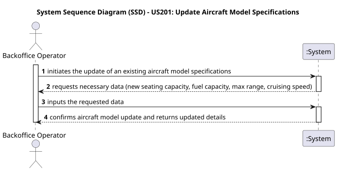
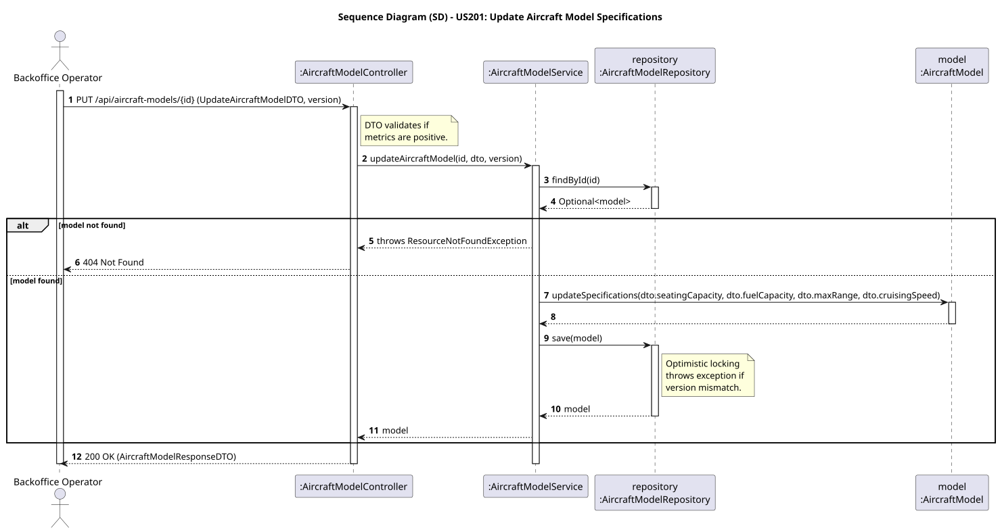

# US201 - Update Aircraft Model Specifications

## User Story
> As a Backoffice Operator, I want to update an aircraft model's specifications.

## Acceptance Criteria
- The request must provide the new values for `seatingCapacity`, `fuelCapacity`, `maxRange`, and `cruisingSpeed`.
- All performance and capacity metrics must be strictly positive values.
- The system must ensure concurrency control using optimistic locking to prevent overlapping updates.
- On success, the system returns HTTP 200 OK with the updated model details.

## Pre-conditions
- The actor is authenticated as a `BACKOFFICE_OPERATOR`.
- The `AircraftModel` to be updated exists in the system.

## Post-conditions
- The `AircraftModel` entity is updated in the database with the new specifications and its version is incremented.

## Main Success Scenario
1. The actor sends a `PUT /api/aircraft-models/{id}` request with the updated payload and the expected version.
2. The system validates the request fields and constraints.
3. The system fetches the existing `AircraftModel` from the database.
4. The system validates the version for optimistic locking.
5. The system updates the `AircraftModel` entity in memory.
6. The system persists the updated model in the database.
7. The system returns HTTP 200 OK with the detailed DTO.

## Alternative / Exception Flows
| Step | Condition | System Response |
|------|-----------|-----------------|
| 2 | Request payload is missing fields or has negative metrics | HTTP 400 Bad Request |
| 3 | Aircraft model does not exist | HTTP 404 Not Found |
| 4 | The version provided does not match the current version in the database (Concurrency Conflict) | HTTP 409 Conflict |

## Design Justification
- **Domain-Driven Design (DDD):** `AircraftModel` acts as an Entity in our domain.
- **Security & Authorization:** The endpoint is secured as a cross-cutting concern using Spring Security JWT (`@PreAuthorize`).
- **DTO Pattern & HATEOAS:** Inputs and outputs are strictly isolated from domain entities using `UpdateAircraftModelDTO` for requests and `AircraftModelResponseDTO` for responses. The response DTO includes HAL-compliant relational links (HATEOAS).
- **Concurrency Control:** We use `@Version` annotation from JPA/Hibernate on the `AircraftModel` entity to enforce optimistic locking. This ensures that if two Backoffice Operators attempt to update the same model simultaneously, the second one will receive a conflict error and won't blindly overwrite the first operator's changes.

## Sequence Diagrams

### System Sequence Diagram

### Sequence Diagram

