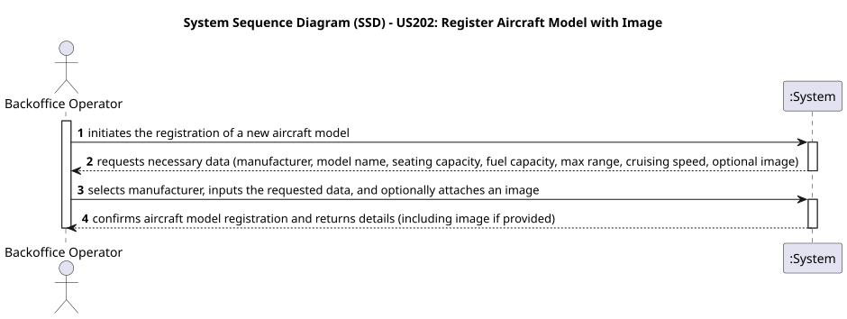
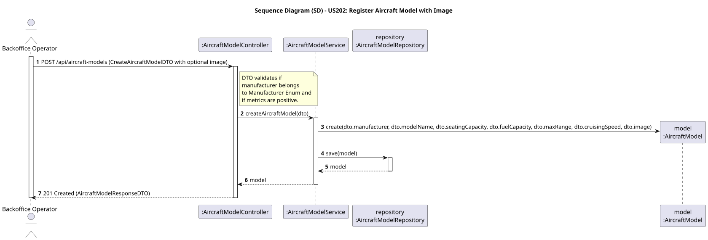

# US202 - Register Aircraft Model with Image

## User Story
> As a Backoffice Operator, I want to register an aircraft model with an optional image or technical diagram.

## Acceptance Criteria
- The request payload for creating an aircraft model (`POST /api/aircraft-models`) may optionally include an `image` field containing a Base64 encoded string of the image.
- The system must persist the image in the database.
- If the image is provided, it must be returned in the response payload.
- On success, the system returns HTTP 201 Created with the model details including the image (if present).

## Pre-conditions
- The actor is authenticated as a `BACKOFFICE_OPERATOR`.

## Post-conditions
- A new `AircraftModel` entity is persisted in the database, potentially including a binary image representation.

## Main Success Scenario
1. The actor sends a `POST /api/aircraft-models` request with the model payload, including an optional `image` (Base64 string).
2. The system validates the request fields and constraints.
3. The system parses the Base64 image into a byte array.
4. The system creates the `AircraftModel` entity in memory.
5. The system persists the model in the database.
6. The system returns HTTP 201 Created with the detailed DTO (including the Base64 image string).

## Alternative / Exception Flows
| Step | Condition | System Response |
|------|-----------|-----------------|
| 2 | Request payload is missing required fields or has negative metrics | HTTP 400 Bad Request |

## Design Justification
- **Domain-Driven Design (DDD):** `AircraftModel` is an Entity. It has been updated to include an `image` attribute (stored as a Large Object `byte[]`).
- **Data Transfer & HATEOAS:** To simplify the REST API consumption from frontend applications, we utilize Jackson's automatic Base64-to-byte[] deserialization. The frontend sends the image as a standard JSON string property (`"image": "iVBORw0KGgo..."`), and the API returns it in the same format using `AircraftModelResponseDTO`, which also injects necessary HATEOAS self-links.
- **Optionality:** The image field is not mandatory, allowing models to be registered with just technical specs if no diagram is available.

## Sequence Diagrams

### System Sequence Diagram

### Sequence Diagram

