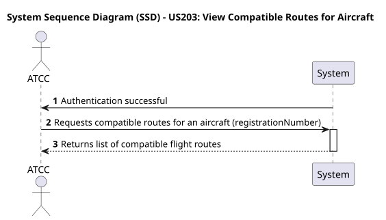
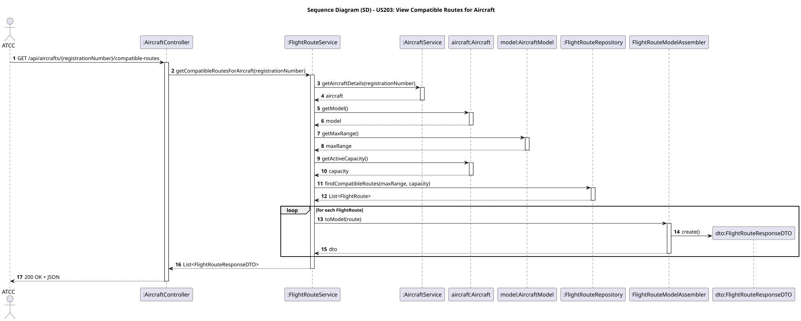

# US203 - View Compatible Routes for Aircraft

## User Story
> As an ATCC, I want to view which routes are compatible with a specific aircraft based on its range and capacity.

## Acceptance Criteria
- The system must evaluate the capacity based on the specific active configuration of the aircraft.
- The system must evaluate the range of the aircraft's model against the route's minimum requirements.
- The same airplane model can have different seat configurations, hence different capacities.
- On success, the system returns HTTP 200 OK with a list of compatible routes.

## Pre-conditions
- The actor is authenticated as an `ATCC` (Air Traffic Control Center).
- The `Aircraft` exists in the system and has an assigned model.

## Post-conditions
- N/A (This is a pure data retrieval operation).

## Main Success Scenario
1. The actor sends a `GET /api/aircrafts/{registrationNumber}/compatible-routes` request.
2. The system fetches the existing `Aircraft` based on its registration number.
3. The system extracts the active seating capacity of the specific aircraft.
4. The system extracts the maximum range of the model associated with the aircraft.
5. The system delegates the filtering to the `FlightRouteService` which queries the database for routes matching the capacity and range criteria.
6. The system returns HTTP 200 OK with a list of `FlightRouteResponseDTO` objects.

## Alternative / Exception Flows
| Step | Condition | System Response |
|------|-----------|-----------------|
| 2 | Aircraft does not exist | HTTP 404 Not Found |
| 5 | No routes match the criteria | HTTP 200 OK with empty list `[]` |

## Design Justification
- **Domain-Driven Design (DDD):** We maintain context boundaries. The `AircraftService` fetches the aircraft metrics and passes the primitive values (`Integer capacity`, `Double maxRange`) to the `FlightRouteService`.
- **Security:** Access is restricted to `ATCC` roles.

## Sequence Diagrams

### System Sequence Diagram

### Sequence Diagram

