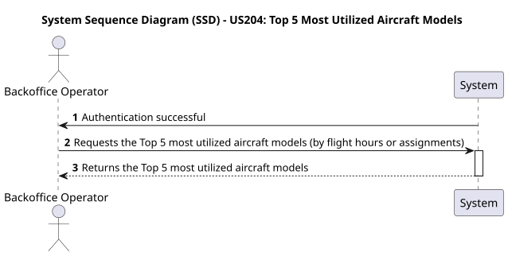
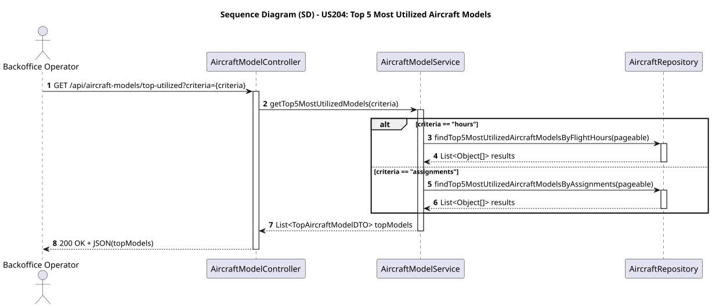

# US204 - Top 5 Most Utilized Aircraft Models

## User Story
> As a Backoffice Operator, I want to see the Top 5 most utilized aircraft models based on total flight hours or number of assignments.

## Acceptance Criteria
- The system must provide a list of exactly up to 5 models.
- The user must be able to specify the criteria (`hours` or `assignments`).
- The list must be sorted descending by the chosen criteria value.
- On success, the system returns HTTP 200 OK.

## Pre-conditions
- The actor is authenticated as a `BACKOFFICE_OPERATOR`.

## Post-conditions
- N/A (Data retrieval only).

## Main Success Scenario
1. The actor sends a `GET /api/aircraft-models/top-utilized?criteria={criteria}` request.
2. The system checks the provided `criteria` value.
3. The system queries the database using a `Pageable` limit of 5.
4. The database calculates the sum of flight hours or assignment counts per model and sorts the output in descending order.
5. The system maps the database raw output into `TopAircraftModelDTO` representations.
6. The system returns HTTP 200 OK with the final list in JSON.

## Alternative / Exception Flows
| Step | Condition | System Response |
|------|-----------|-----------------|
| 2 | Criteria parameter is missing or invalid | HTTP 400 Bad Request with "Invalid criteria" error |

## Design Justification
- **Pagination & Limitations:** We delegate the "Top 5" truncation to the database layer (via Spring Data JPA `Pageable` mechanism) to ensure high performance, rather than fetching all models into memory and sorting them manually.
- **DTO Pattern:** `TopAircraftModelDTO` is created strictly to bind the model object to its calculated utilization metric.

## Sequence Diagrams

### System Sequence Diagram

### Sequence Diagram

