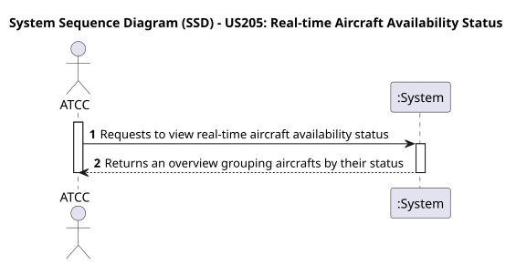
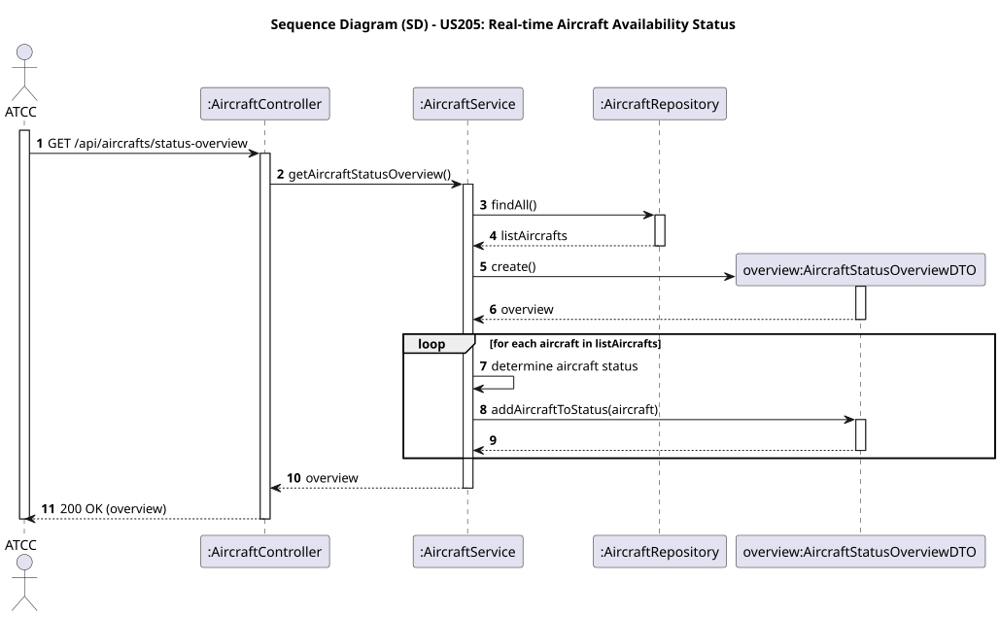

# US205 - Real-time Aircraft Availability Status

## User Story
> As an ATCC, I want to view real-time aircraft availability status (available, in-flight, under maintenance, inactive).

## Acceptance Criteria
- The system must aggregate aircraft by their current status.
- The system must provide cumulative counts for each state.
- Each aircraft must provide contextual links (HATEOAS).
- On success, the system returns HTTP 200 OK with the dashboard summary.

## Pre-conditions
- The actor is authenticated as an `ATCC`.

## Post-conditions
- N/A.

## Main Success Scenario
1. The actor sends a `GET /api/aircrafts/status-overview` request.
2. The system fetches all aircraft records from the database.
3. The system maps each aircraft into a `AircraftResponseDTO` ensuring it generates HATEOAS self-links.
4. The system aggregates these DTOs into specific grouped arrays corresponding to each status label.
5. The system performs a cumulative count to establish `totalAvailable`, `totalInFlight`, `totalUnderMaintenance`, and `totalInactive`.
6. The system returns HTTP 200 OK with the full `AircraftStatusOverviewDTO`.

## Design Justification
- **HATEOAS:** We utilized Spring HATEOAS `RepresentationModel` allowing the client to easily navigate to the specifics of any aircraft retrieved on the dashboard array via `_links.self.href`.
- **Aggregation Strategy:** For phase 2 constraints, the processing of categories happens directly on the service layer, traversing all currently existing data instances to group them semantically.

## Sequence Diagrams

### System Sequence Diagram

### Sequence Diagram

