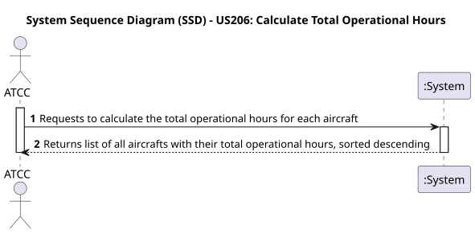
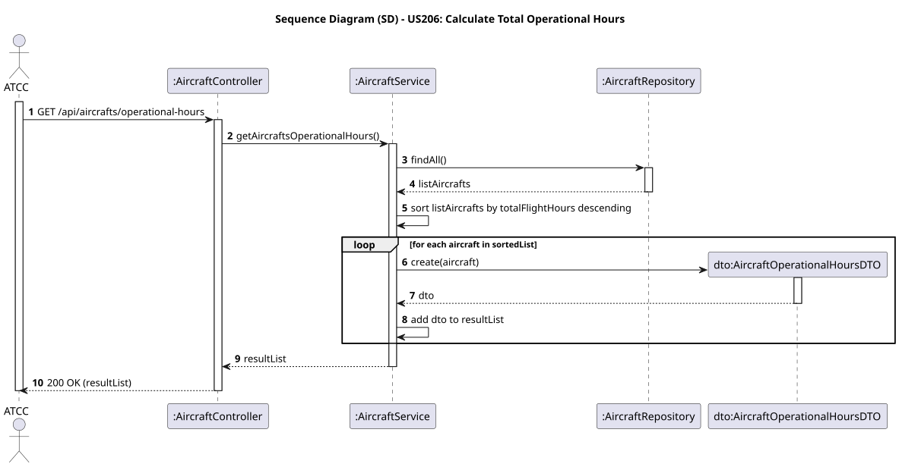

# US206 - Calculate Total Operational Hours

## User Story
> As an ATCC, I want to calculate the total operational hours for each aircraft in my fleet.

## Acceptance Criteria
- The system must return a list of all aircraft instances.
- The return payload must include `registrationNumber`, `modelName`, `status`, and `totalOperationalHours`.
- The list must be strictly sorted by `totalOperationalHours` in descending order.
- The system must provide navigational endpoints (HATEOAS).
- On success, the system returns HTTP 200 OK.

## Pre-conditions
- The actor is authenticated as an `ATCC`.

## Post-conditions
- N/A.

## Main Success Scenario
1. The actor sends a `GET /api/aircrafts/operational-hours` request.
2. The system fetches all the existing aircrafts from the database.
3. The system maps the array utilizing an inline generic sorting method (`Double.compare(a2, a1)`) to impose mathematical descending order.
4. The system injects a `RepresentationModel` link into each mapping (`AircraftOperationalHoursDTO`) targeting `GET /api/aircrafts/{registrationNumber}`.
5. The system returns HTTP 200 OK along with the array of DTOs.

## Design Justification
- **Lean DTO:** Instead of utilizing the standard `AircraftResponseDTO`, we created a dedicated `AircraftOperationalHoursDTO` to restrict unnecessary payload weight, responding exclusively with the exact data points the ATCC requested.
- **HATEOAS:** Navigation links (`_links.self.href`) provide an immediate drill-down perspective for the ATCC operator interacting with any UI client.

## Sequence Diagrams

### System Sequence Diagram

### Sequence Diagram

