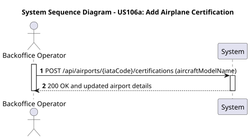
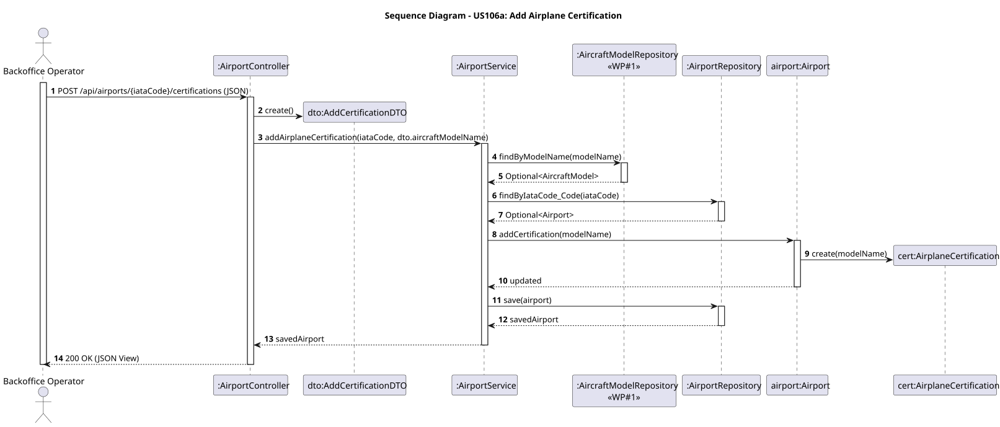

# US106a - Add Airplane Certification to Airport

## User Story
> As a Backoffice Operator, I want to add an airplane certification to an airport so that the system registers which aircraft models are capable of operating there.

## Acceptance Criteria
- The request must specify the target airport via path variable (`iataCode`) and provide the `aircraftModelName` in the body.
- The provided aircraft model name must exist in the Aircraft Subdomain (WP#1).
- An airport cannot be certified for the same aircraft model more than once.
- On success, the system returns HTTP 200 with the updated airport details.

## Pre-conditions
- The actor is authenticated as a Backoffice Operator.
- The airport referenced by `iataCode` exists.
- The aircraft model referenced by `aircraftModelName` exists in the system.

## Post-conditions
- A new `AirplaneCertification` value object is linked to the `Airport`.
- The database is updated with the new certification.

## Main Success Scenario
1. The actor sends a `POST /api/airports/{iataCode}/certifications` request with the model payload.
2. The system queries the `AircraftModelRepository` to ensure the model exists.
3. The system fetches the target `Airport` by its IATA code.
4. The system checks if the certification already exists in the airport's list.
5. The system adds the certification, persists the airport, and returns HTTP 200 OK.

## Alternative / Exception Flows
| Step | Condition | System Response |
|------|-----------|-----------------|
| 2 | The referenced aircraft model does not exist in WP#1 | HTTP 400 Bad Request |
| 3 | The referenced airport does not exist | HTTP 404 Not Found (or 400) |
| 4 | The airport is already certified for this aircraft model | HTTP 409 Conflict (or 400) |

## Design Justification
- **Aggregate Isolation:** Following DDD, the `AirplaneCertification` value object inside the `Airport` aggregate stores only the `aircraftModelName` (a String identifier) rather than a direct reference to the `AircraftModel` entity. This decouples WP#2 from WP#1.
- **Application Service Validation:** The referential integrity is validated at the application service level (`AirportService`), which consults the `AircraftModelRepository` before mutating the domain.

### System Sequence Diagram

### Sequence Diagram

