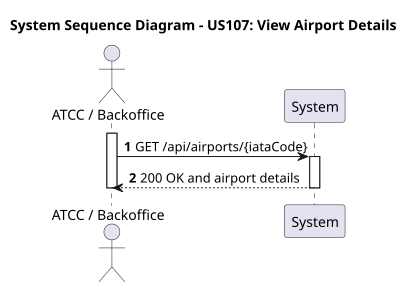
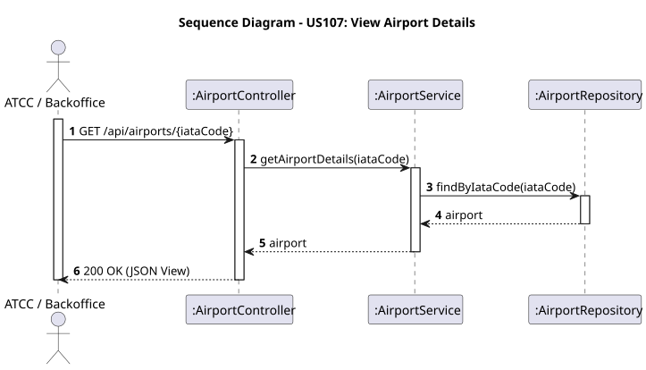

# US107 - View Airport Details

## User Story
> As an ATCC or Backoffice Operator, I want to view the details of a specific airport.

## Acceptance Criteria
- The request must specify the airport's `iataCode` in the URL.
- On success, the system returns HTTP 200 with the full details of the requested airport (designation, location, timezone, runways, certifications, etc.).

## Pre-conditions
- The actor is authenticated.
- The airport referenced by `iataCode` exists.

## Post-conditions
- None (Read-only operation).

## Main Success Scenario
1. The actor sends a `GET /api/airports/{iataCode}` request.
2. The system queries the database for the airport using the IATA code.
3. The system returns HTTP 200 OK with the airport details.

## Alternative / Exception Flows
| Step | Condition | System Response |
|------|-----------|-----------------|
| 2 | The requested airport does not exist | HTTP 404 Not Found (or 400) |

## Design Justification
- **Direct Querying:** Uses Spring Data JPA's `findByIataCode_Code` to retrieve the aggregate directly.

### System Sequence Diagram

### Sequence Diagram
