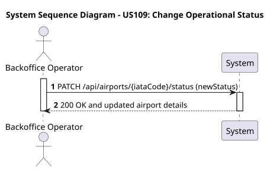
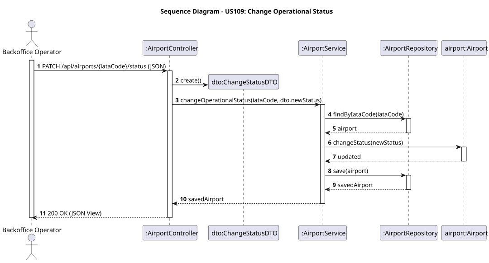

# US109 - Change Operational Status

## User Story
> As a Backoffice Operator, I want to change the operational status of an airport (e.g., from OPERATIONAL to MAINTENANCE).

## Acceptance Criteria
- The request must specify the `iataCode` in the path and the `newStatus` in the body.
- Allowed statuses are: `OPERATIONAL`, `MAINTENANCE`, and `CLOSED`.
- The new status must be different from the current status.
- On success, the system returns HTTP 200 with the updated airport details.

## Pre-conditions
- The actor is authenticated as a Backoffice Operator.
- The airport referenced by `iataCode` exists.

## Post-conditions
- The `Airport` entity's status is updated in the database.
- Mutating operations in other subdomains (like flight routes) might be blocked or affected if the status changes to CLOSED.

## Main Success Scenario
1. The actor sends a `PATCH /api/airports/{iataCode}/status` request with the new status.
2. The system parses the new status and fetches the corresponding airport.
3. The system applies the new status to the airport.
4. The system persists the changes and returns HTTP 200 OK.

## Alternative / Exception Flows
| Step | Condition | System Response |
|------|-----------|-----------------|
| 2 | The requested airport does not exist | HTTP 404 Not Found (or 400) |
| 2 | The provided status string is not a valid enum value | HTTP 400 Bad Request |
| 3 | The airport is already in the requested status | HTTP 400 Bad Request |

## Design Justification
- **Information Expert Pattern:** The status change is not handled externally; instead, the `Airport` domain entity exposes a `changeStatus(AirportStatus newStatus)` method, ensuring that state transitions and business validations remain encapsulated inside the domain object.

### System Sequence Diagram

### Sequence Diagram
