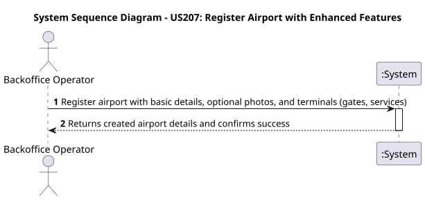
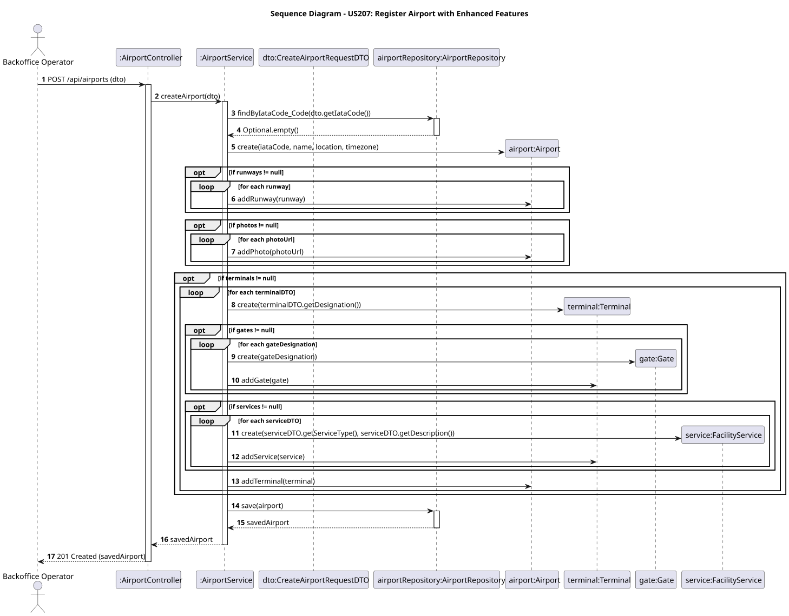

# US207 - Register Airport with Enhanced Features

## User Story
> As a Backoffice Operator, I want to register an airport with optional photos and detailed facilities information (terminals, gates, services) so that the system maintains a complete profile of the airport infrastructure.

## Acceptance Criteria
- The system must support the inclusion of optional photos (URLs) during airport registration.
- The system must allow specifying one or more terminals.
- Each terminal can have a list of gates and a list of services (e.g., Lounge, Retail) with their types and descriptions.
- On success, the system returns HTTP 201 with the created Airport details including its nested terminals.

## Pre-conditions
- The actor is authenticated as a Backoffice Operator.

## Post-conditions
- A new `Airport` entity is persisted in the database.
- The terminals, gates, and services are persisted and linked correctly to the `Airport`.
- The created airport becomes available for flight route definitions.

## Main Success Scenario
1. The actor sends a `POST /api/airports` request with the enhanced airport payload (including terminals and photos).
2. The system validates the request fields.
3. The system checks if an airport with the given IATA code already exists.
4. The system instantiates `Terminal` entities along with their `Gate` and `FacilityService` value objects.
5. The system persists the airport and returns HTTP 201 Created with the detailed DTO.

## Alternative / Exception Flows
| Step | Condition | System Response |
|------|-----------|-----------------|
| 2 | Request payload is missing required fields or invalid formats | HTTP 400 Bad Request |
| 3 | An airport with the provided IATA code already exists | HTTP 409 Conflict |
| 1 | The actor is not a Backoffice Operator | HTTP 403 Forbidden |

## Design Justification
- **Domain-Driven Design (DDD):** The `Airport` aggregate root is expanded to contain a collection of `photos` (Value Objects) and a collection of `Terminal` local entities. Each `Terminal` contains collections of `Gate` and `FacilityService` value objects to reflect real-world infrastructure boundaries.
- **Transactional Consistency:** Saving the entire deeply nested object graph is wrapped in a `@Transactional` operation.

### System Sequence Diagram

### Sequence Diagram
