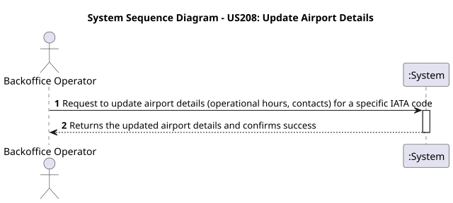
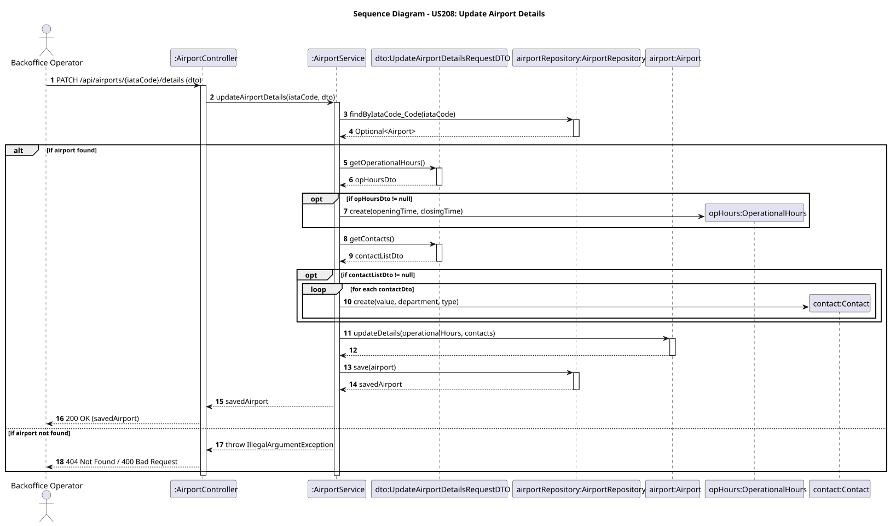

# US208 - Update Airport Details

## User Story
> As a Backoffice Operator, I want to update airport details including operational hours and contact information so that the system maintains accurate metadata.

## Acceptance Criteria
- The system must allow updating the operational hours (opening and closing times).
- The system must allow adding/updating contact information (e.g., phone, email) with their respective departments.
- Proper input validation for time formats and contact details is required.
- On success, the system returns HTTP 200 with the updated Airport details.

## Pre-conditions
- The actor is authenticated as a Backoffice Operator.
- The target airport exists in the system.

## Post-conditions
- The `Airport` entity is updated with the new operational hours and/or contacts.

## Main Success Scenario
1. The actor sends a `PATCH /api/airports/{iataCode}/details` request with the update payload.
2. The system validates the request fields.
3. The system fetches the existing `Airport` by its IATA code.
4. The system delegates the changes to the domain entity by calling `updateDetails()`.
5. The system persists the airport and returns HTTP 200 OK with the updated DTO.

## Alternative / Exception Flows
| Step | Condition | System Response |
|------|-----------|-----------------|
| 3 | The target airport does not exist | HTTP 404 Not Found |
| 2 | Request payload contains invalid time formats or contact strings | HTTP 400 Bad Request |
| 1 | The actor is not a Backoffice Operator | HTTP 403 Forbidden |

## Design Justification
- **Domain-Driven Design (DDD):** Updates affect the `Airport` aggregate root. `OperationalHours` and `Contact` are treated as Value Objects, meaning they are completely replaced rather than modified individually, ensuring immutability at the lowest level.

### System Sequence Diagram

### Sequence Diagram
