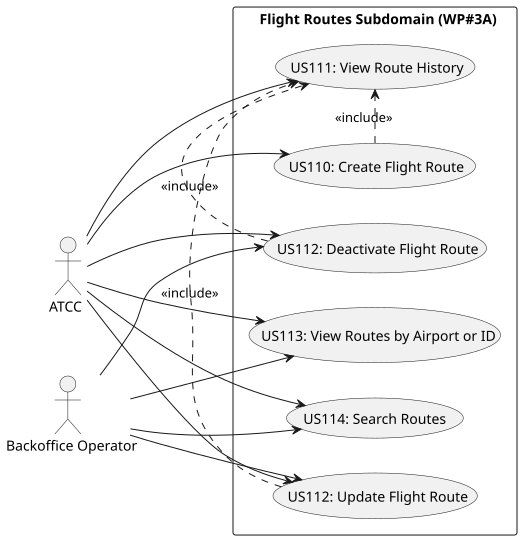
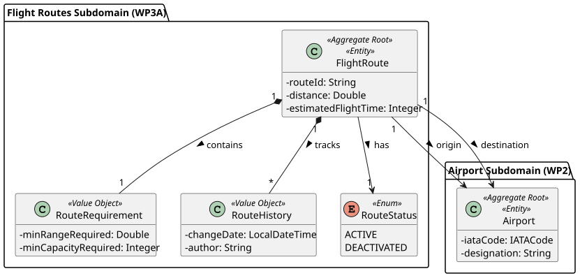
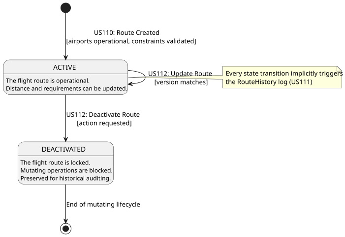

# Work Package 3A (WP#3A) - Flight Routes Management

## 1. Overview
This Work Package encapsulates the domain logic, services, and APIs required to manage Flight Routes within the system. It handles the complete lifecycle of flight routes, including their creation, constraint validation, modification, deactivation, and rigorous historical auditing.

## 2. Implemented User Stories
The following functionalities have been fully implemented, tested, and documented:

* **[US110 - Create Flight Route](./US110/README.md):** Allows the creation of a route by specifying origin, destination, and minimum aircraft requirements (range, capacity).
* **[US111 - Track Route History](./US111/README.md):** An implicit domain-driven behavior that automatically audits all mutating lifecycle events of a route.
* **[US112 - Update or Deactivate Route](./US112/README.md):** Allows parameter updates and route deactivation. This feature is heavily protected by Optimistic Locking mechanisms to prevent concurrency conflicts.
* **[US113 - View Route Details](./US113/README.md):** Enables fetching detailed route information by its unique ID or retrieving all routes departing from a specific origin airport.
* **[US114 - Search Routes](./US114/README.md):** Advanced, paginated, and case-insensitive search functionality filtering routes by origin and/or destination.

## 3. Global Design Artifacts (WP Level)
The following diagrams illustrate the overarching architecture, use cases, and domain rules specific to the Flight Routes subdomain:

### Use Case Diagram (UCD)
Maps the system's actors to their available operations, including implicit inclusions (such as automatic history tracking).

### Domain Model (DM)
Represents the conceptual business entities, value objects, and aggregates specific to this Work Package, decoupled from technical implementation details.

### State Machine Diagram (SMD)
Details the strict lifecycle transitions (from `ACTIVE` to `DEACTIVATED`) of a Flight Route entity and how mutations are handled conditionally.
