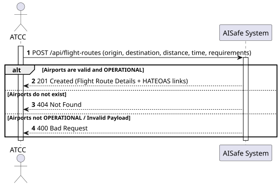
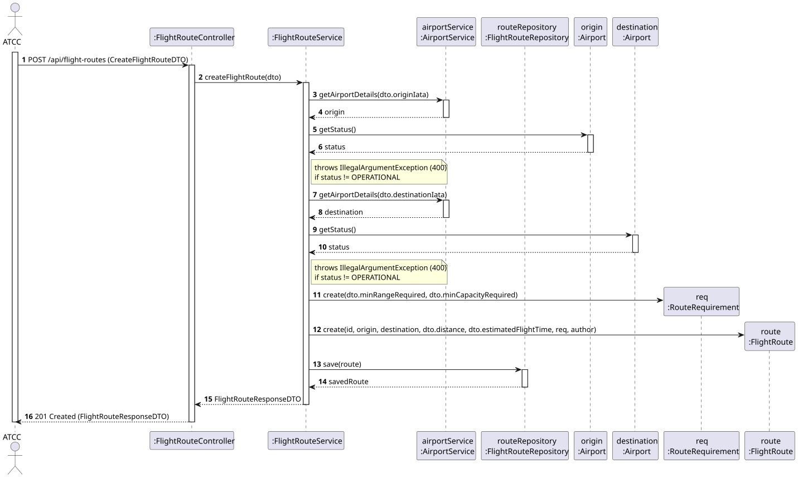
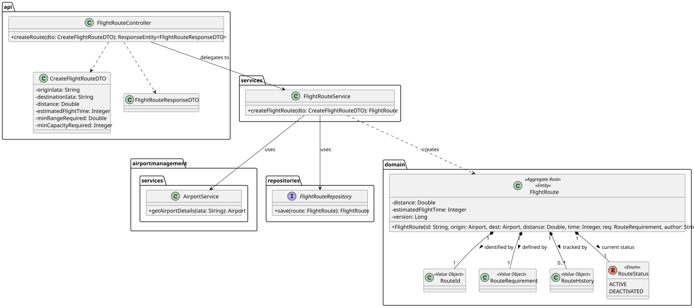

# US110 - Create Flight Route

## 1. Requirements Engineering

### 1.1. User Story Description
As an ATCC (Air Traffic Control Center), I want to create a flight route by specifying the origin airport, destination airport, estimated flight time, and minimum aircraft requirements (range, capacity). The system should verify that both airports exist[cite: 4].

### 1.2. Customer Specifications and Clarifications
* **Airport Verification:** The system must actively validate the existence of both the origin and destination airports within the system using their unique identifiers (IATA Codes)[cite: 4].
* **Operational Status:** A route can only be successfully created if both the origin and destination airports are currently `OPERATIONAL`[cite: 1].
* **Route Constraints:** A route cannot have the same airport as both its origin and destination[cite: 4].
* **Data Validation:** All technical parameters such as distance, estimated flight time, minimum range, and minimum capacity must be strictly positive values[cite: 4].

### 1.3. Acceptance Criteria
* **AC1:** The system must return an error (`400 Bad Request` or `404 Not Found`) if either the origin or destination airport does not exist[cite: 4].
* **AC2:** The system must return an error (`400 Bad Request`) if either airport is not in an `OPERATIONAL` status[cite: 1].
* **AC3:** The system must prevent route creation if the origin and destination airports are identical[cite: 4].
* **AC4:** All structural and numerical fields must pass validation before the business logic is executed[cite: 4].
* **AC5:** Upon successful creation, the route is persisted with an initial `ACTIVE` status, and a `201 Created` response containing HATEOAS links is returned[cite: 4].

### 1.4. Operating System and Layer Allocation
* **Controller:** `FlightRouteController` intercepts the HTTP POST request and handles input validation using DTO annotations[cite: 4].
* **Service:** `FlightRouteService` orchestrates the domain rule evaluations and database lookups[cite: 4].
* **Domain:** `FlightRoute` and `RouteRequirement` encapsulate core business constraints and state definitions[cite: 4].

## 2. Analysis & Design

### 2.1. Pre-Conditions
* The system must have the target airports (Origin and Destination) already bootstrapped/registered[cite: 4].
* The operating user must possess the authorized role (ATCC)[cite: 4].

### 2.2. Post-Conditions
* A new `FlightRoute` aggregate root is safely persisted in the relational database[cite: 4].
* An initial auditing log is appended to the route's lifecycle history[cite: 4].

### 2.3. Design Artifacts
* **System Sequence Diagram (SSD):** Documents the basic interaction boundaries between the ATCC and the System.

* **Sequence Diagram (SD):** Showcases the dynamic interaction, dependency injection, and data flow from the API layer down to the persistence layer.

* **Class Diagram (CD):** Highlights structural relationships, associations, and encapsulation boundaries.
