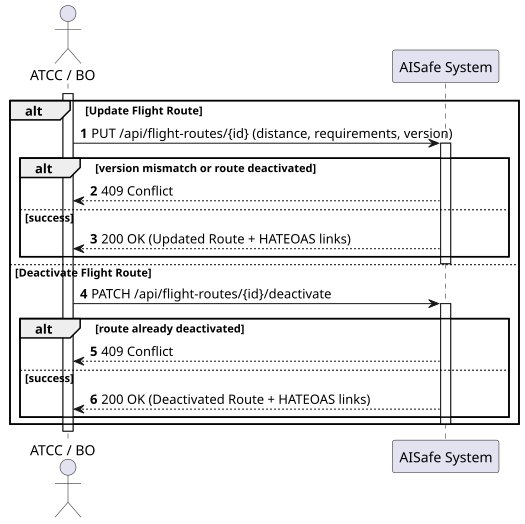
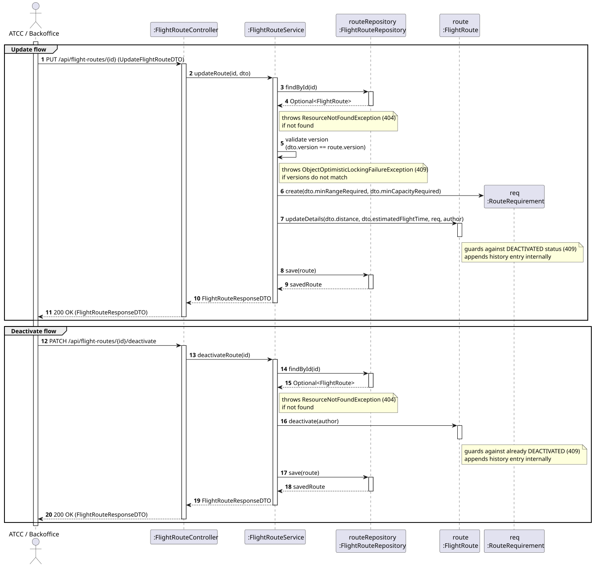
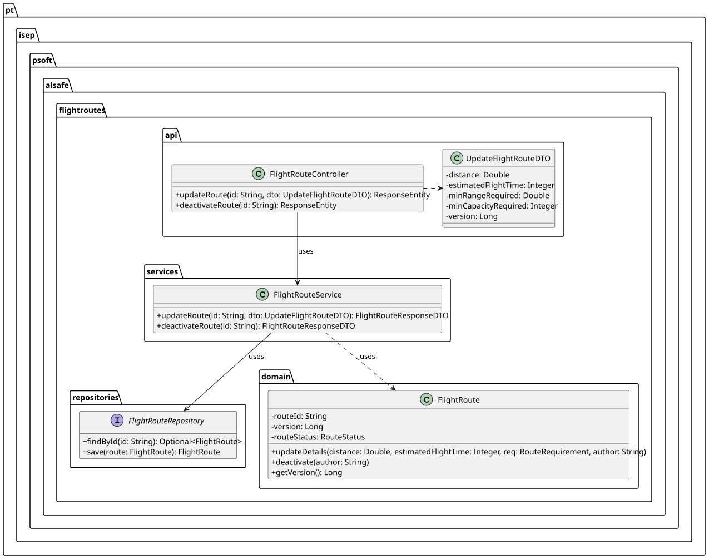

# US112 - Update or Deactivate a Flight Route

## 1. Requirements Engineering

### 1.1. User Story Description
As an ATCC or Backoffice Operator, I want to update or deactivate a flight route.

### 1.2. Customer Specifications and Clarifications
* **Deactivation:** Routes cannot be deleted to preserve history. They must be marked as `DEACTIVATED`. An already deactivated route cannot be deactivated again.
* **Update Constraints:** A deactivated route is considered "locked" and its parameters (distance, requirements) cannot be updated.
* **Concurrency Protection (Optimistic Locking):** Since multiple operators might attempt to edit the same route simultaneously, the system must employ Optimistic Locking. Clients must provide the `version` they are editing. If the database version is newer, the request is rejected with a Conflict error.

### 1.3. Acceptance Criteria
* **AC1:** A `PATCH` request to deactivate must transition the route status to `DEACTIVATED` and append a log to the route's history.
* **AC2:** Attempting to update or deactivate a route that is already deactivated must yield a `400 Bad Request`.
* **AC3:** A `PUT` request to update a route must contain a `version` field. If this version does not match the current database version, the system must abort and return `409 Conflict`.
* **AC4:** All successful updates must automatically reflect in the route's historical audit trail (as defined in US111).

## 2. Analysis & Design

### 2.1. Pre-Conditions
* The flight route must exist in the database.
* To perform an update (`PUT`), the route must currently be in an `ACTIVE` state.

### 2.2. Post-Conditions
* The route's state or parameters are mutated, and the `version` field is incremented.
* A new `RouteHistory` record is generated.

### 2.3. Design Artifacts

* **System Sequence Diagram (SSD):**

* **Sequence Diagram (SD):** Focuses on the Update (`PUT`) operation, highlighting the optimistic locking validation mechanism.

* **Class Diagram (CD):**
