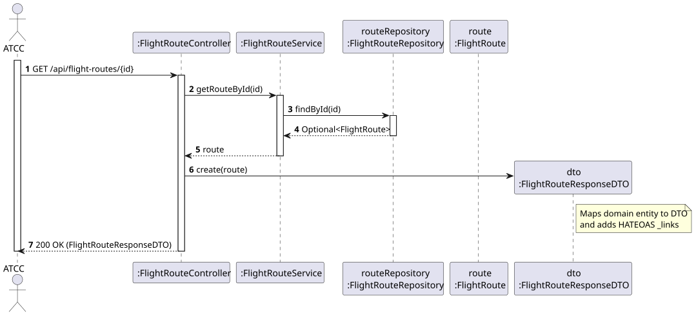
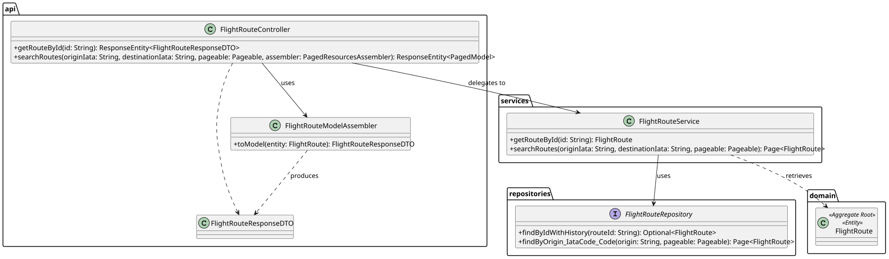

# US113 - View Routes by Airport or by ID

## 1. Requirements Engineering

### 1.1. User Story Description
As an ATCC or Backoffice Operator, I want to view all routes from a specific airport, and to view the details of a route given its ID.

### 1.2. Customer Specifications and Clarifications
* **View by ID:** The system must allow fetching the exact details of a single flight route using its unique domain identifier.
* **View by Origin Airport:** The system must list all existing flight routes departing from a specified IATA code.
* **Pagination:** Since querying by an airport can return hundreds of routes, the response must be paginated to avoid overwhelming the client and the database network.

### 1.3. Acceptance Criteria
* **AC1:** A `GET` request with a valid Route ID must return a `200 OK` and the complete route details in JSON format, enriched with HATEOAS links (`self`, `history`, `deactivate`, etc.).
* **AC2:** A `GET` request with an invalid Route ID must return a `404 Not Found`.
* **AC3:** A `GET` request querying by an origin IATA code must return a `200 OK` with a paginated list of routes (`Pageable`). The response must include pagination metadata and navigation links.

## 2. Analysis & Design

### 2.1. Pre-Conditions
* The queried routes and airports must exist in the database.
* The user must have sufficient Role privileges (`ATCC` or `BACKOFFICE_OPERATOR`) to access the endpoints.

### 2.2. Post-Conditions
* No domain data is mutated. The system safely retrieves the requested data, maps it into Data Transfer Objects (DTOs), and serves it cleanly.

### 2.3. Design Artifacts

* **System Sequence Diagram (SSD):** Outlines the high-level actor-system interactions for both specific lookup and general search.

* **Sequence Diagram (SD):** Demonstrates the usage of `FlightRouteModelAssembler` for single entities and Spring's `PagedResourcesAssembler` for paginated route searches to achieve Richardson Maturity Model Level 3.

* **Class Diagram (CD):** Maps the structural dependencies to execute the fetch and mapping operations.
