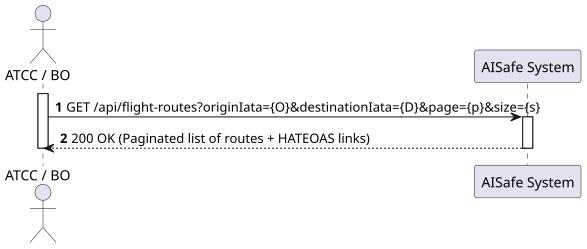
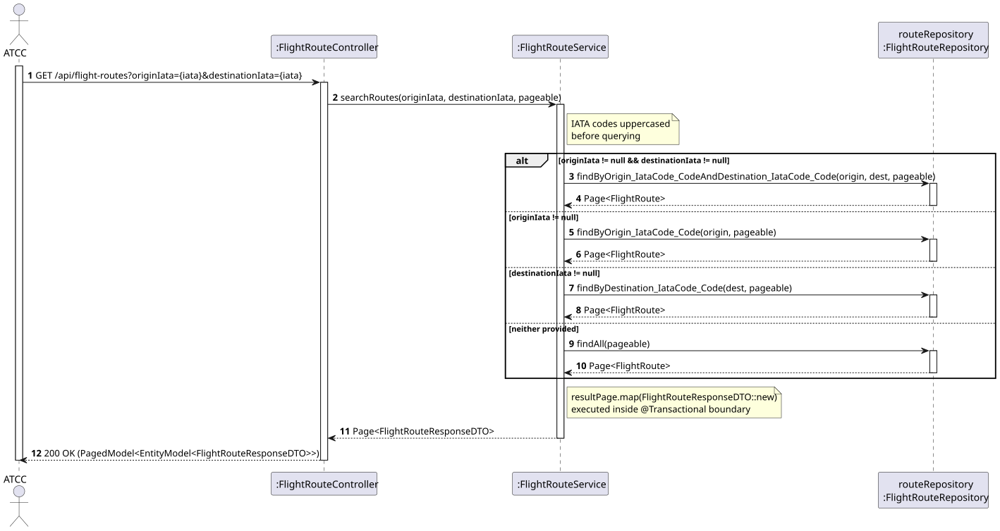

# US114 - Search Flight Routes (Origin, Destination, or Both)

## 1. Requirements Engineering

### 1.1. User Story Description
As an ATCC, I want to search for routes by origin, destination, or both.

### 1.2. Customer Specifications and Clarifications
* **Dynamic Search:** The query parameters must be optional. The system must adapt its search based on whether the user provided only the Origin, only the Destination, both, or neither.
* **Tolerance to Input (UX Check):** The system must be tolerant to case-insensitivity (e.g., searching for `opo` should automatically resolve to `OPO`).
* **Performance:** The system must implement pagination to avoid database overload when returning large sets of routes.

### 1.3. Acceptance Criteria
* **AC1:** The system must support optional query parameters (`originIata`, `destinationIata`).
* **AC2:** Inputs must be sanitized to uppercase before querying the database to ensure case-insensitivity.
* **AC3:** The system must return a `Page<FlightRouteResponseDTO>` object containing HATEOAS links and pagination metadata (`page`, `size`, `totalElements`).

## 2. Analysis & Design

### 2.1. Pre-Conditions
* Routes exist in the database.

### 2.2. Post-Conditions
* A paginated structure containing the matching routes is returned.

### 2.3. Design Artifacts
* **System Sequence Diagram (SSD):**

* **Sequence Diagram (SD):** Showcases the dynamic routing and case-insensitivity logic.
