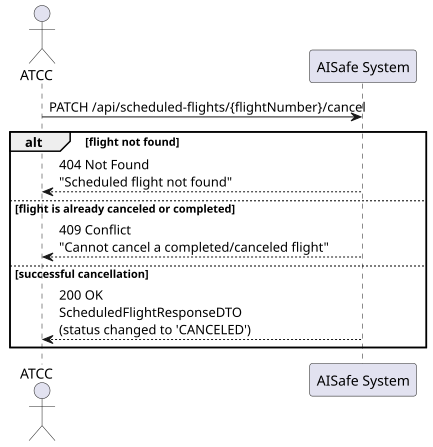
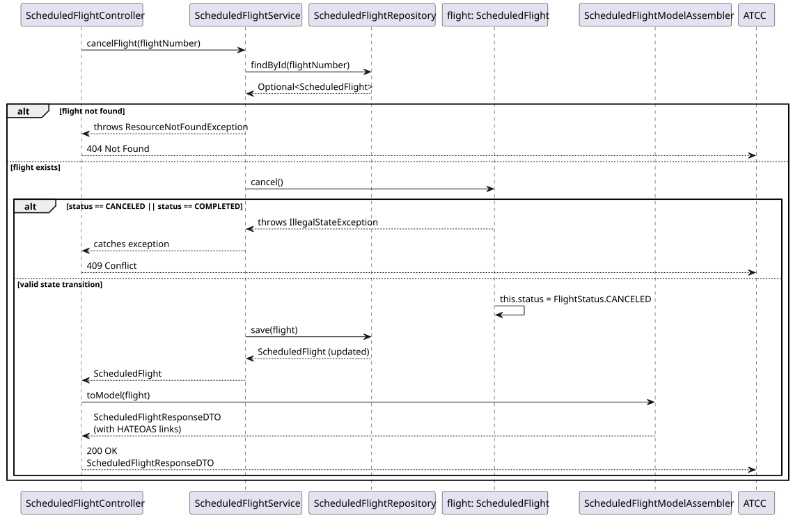
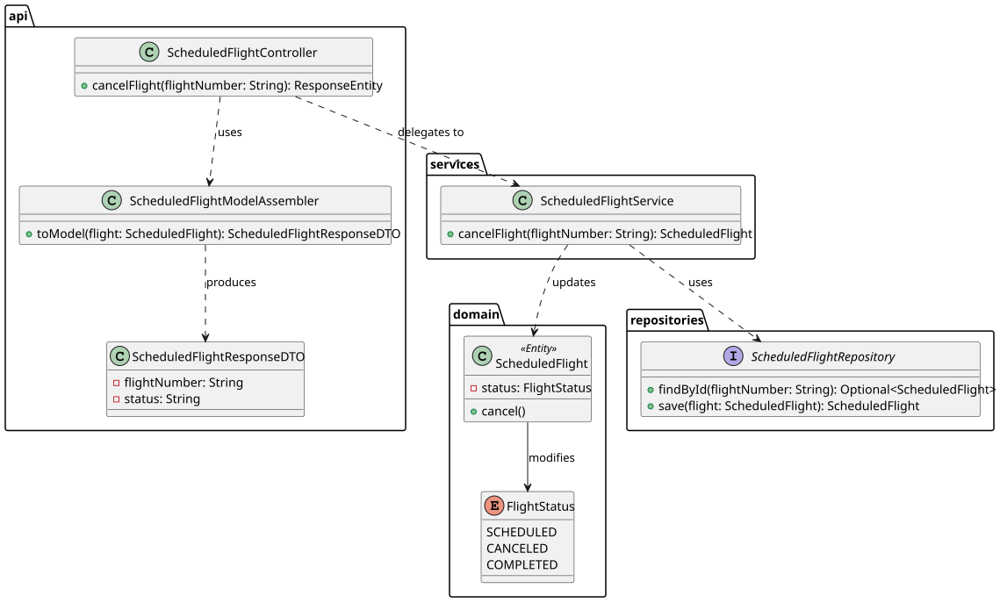

# Bonus — Cancel a Scheduled Flight

## 1. User Story

> As an ATCC, I want to cancel a scheduled flight, freeing the aircraft for reassignment.

## 2. Acceptance Criteria

- The scheduled flight must exist (otherwise 404 Not Found).
- A flight that is already `CANCELED` or `COMPLETED` cannot be canceled (returns 409 Conflict).
- Canceling a flight must logically free up the associated aircraft for that time slot.
- The endpoint must be secured with JWT, requiring the `ATCC` role.
- Response includes HATEOAS links.

## 3. Design Decisions

### Rich Domain Model Encapsulation
The business rules dictating state transitions (e.g., verifying that a `COMPLETED` flight cannot be canceled) are encapsulated directly within the `cancel()` method of the `ScheduledFlight` entity. This avoids the anti-pattern of an anemic domain model and ensures that the entity protects its own invariants, keeping the `ScheduledFlightService` clean and focused solely on orchestration.

### HTTP PATCH Method
The endpoint utilizes the `PATCH` HTTP method (`PATCH /api/scheduled-flights/{flightNumber}/cancel`). This aligns perfectly with RESTful principles, as the operation represents a partial update (changing the status) rather than replacing the entire resource (`PUT`) or physically removing the record from the database (`DELETE`), which would compromise audit trails.

### Seamless Aircraft Reassignment
By updating the flight's status to `CANCELED`, the aircraft is automatically and immediately freed up for new assignments. This works seamlessly with the Pessimistic Locking query implemented in US212 (`findOverlappingFlightsWithLock`), which explicitly filters for overlaps only where `sf.status = 'SCHEDULED'`.

## 4. Diagrams

### System Sequence Diagram

### Sequence Diagram

### Class Diagram
