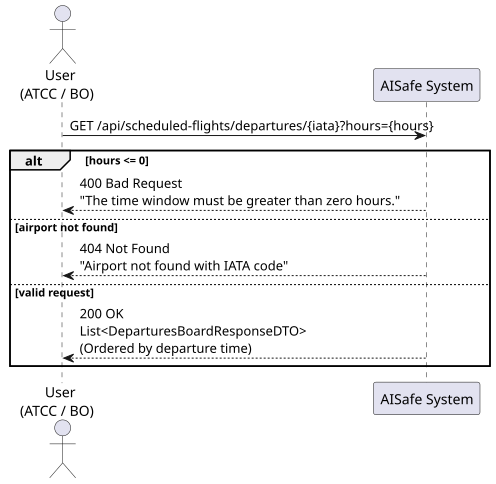
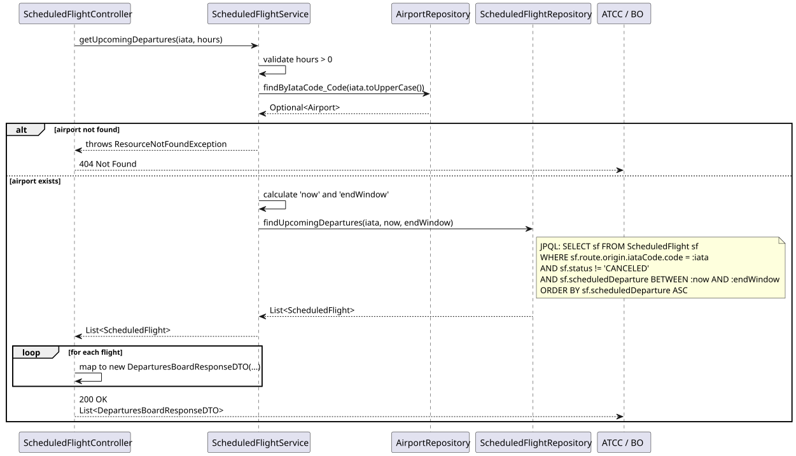
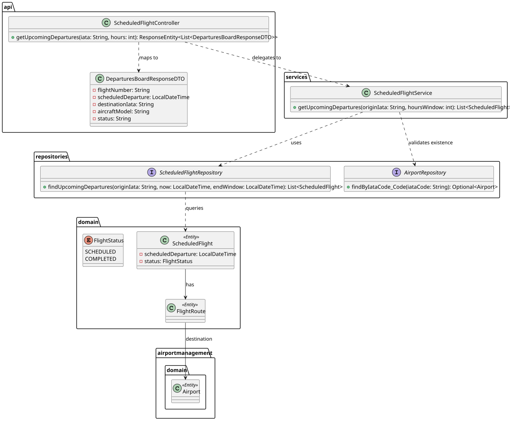

# Bonus — Departures Board

## 1. User Story

> As a Backoffice Operator or ATCC, I want to view upcoming departures from a specific airport within a configurable time window.

## 2. Acceptance Criteria

- The system must return a list of flights departing from the specified origin airport.
- The airport must exist (otherwise returns 404 Not Found).
- The list must only include flights departing between "now" and "now + X hours" (configurable via query parameter, defaults to 24h).
- The `hours` parameter must be strictly positive (otherwise 400 Bad Request).
- Canceled flights (`CANCELED`) must be excluded from the board.
- The results must be ordered chronologically by departure time (ascending).
- The endpoint must be secured with JWT, allowing `BACKOFFICE_OPERATOR` or `ATCC` roles.

## 3. Design Decisions

### Time-Windowed Database Query
Filtering the flights by the time window (`now` to `endWindow`) is done strictly at the database level using a JPQL query in the `ScheduledFlightRepository`. This ensures that the database only loads the relevant flights into application memory, avoiding the massive performance hit of loading all scheduled flights and filtering them using Java Streams. 

### Lightweight DTO Projection
A departures board (often rendered on physical screens in airports) requires a fast, flattened data structure. Instead of reusing the standard `ScheduledFlightResponseDTO` (which includes full HATEOAS links and complex identifiers), the Controller dynamically maps the entities to a purpose-built `DeparturesBoardResponseDTO`. This flat structure provides exactly what the UI needs (flight number, destination IATA, time, aircraft model, and status) with minimal payload size.

### Early Airport Validation
The service performs an early existence check on the provided IATA code using `airportRepository`. If the airport does not exist, it throws a `ResourceNotFoundException`. This allows the API to return a clear `404 Not Found` rather than an empty list (which would wrongly imply that the airport exists but has zero upcoming flights).

## 4. Diagrams

### System Sequence Diagram

### Sequence Diagram

### Class Diagram
