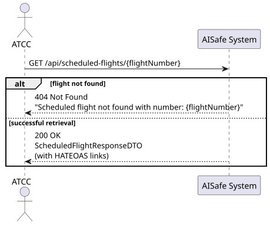
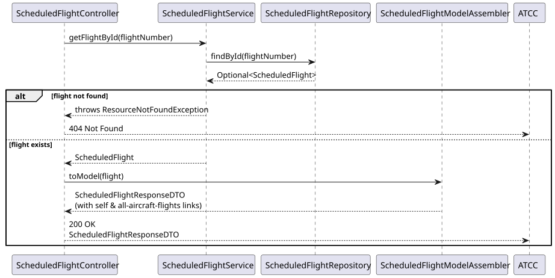
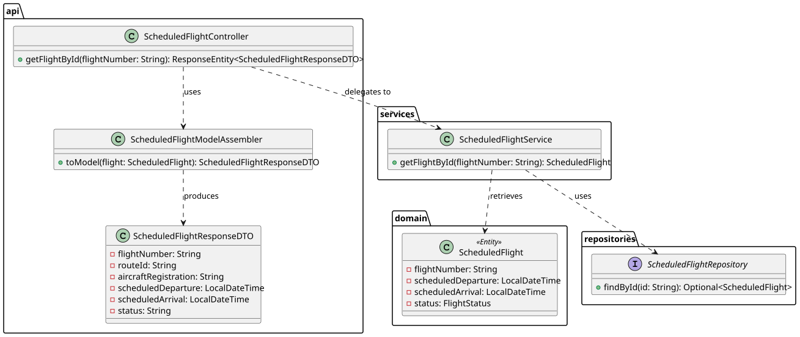

# Bonus — Get Scheduled Flight By ID

## 1. User Story

> As an ATCC, I want to retrieve the details of a specific scheduled flight using its flight number.

## 2. Acceptance Criteria

- The scheduled flight must exist (otherwise returns 404 Not Found).
- The endpoint must be secured with JWT, requiring the `ATCC` role.
- The response must include HATEOAS links (`self` and `all-aircraft-flights`).

## 3. Design Decisions

### Enabler for HATEOAS (Richardson Maturity Model Level 3)
While not explicitly requested as a standalone user story in the initial assignment requirements, this endpoint (`GET /api/scheduled-flights/{flightNumber}`) is an architectural necessity. In US212 (Schedule a Flight) and US213 (View Scheduled Flights), the REST API returns a `ScheduledFlightResponseDTO` containing a `self` link. For that link to be resolvable and REST-compliant, this endpoint must exist to serve the resource.

### Direct Primary Key Lookup
Since the `flightNumber` is a UUID generated at the domain level upon creation, the service uses Spring Data JPA's native `findById` method. This guarantees an indexed, O(1) database lookup for optimal performance.

## 4. Diagrams

### System Sequence Diagram

### Sequence Diagram

### Class Diagram
