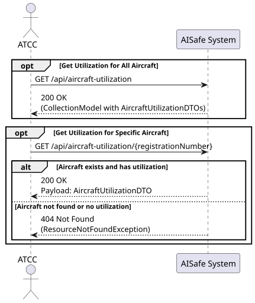
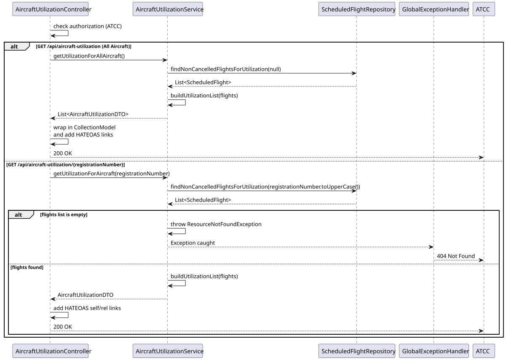
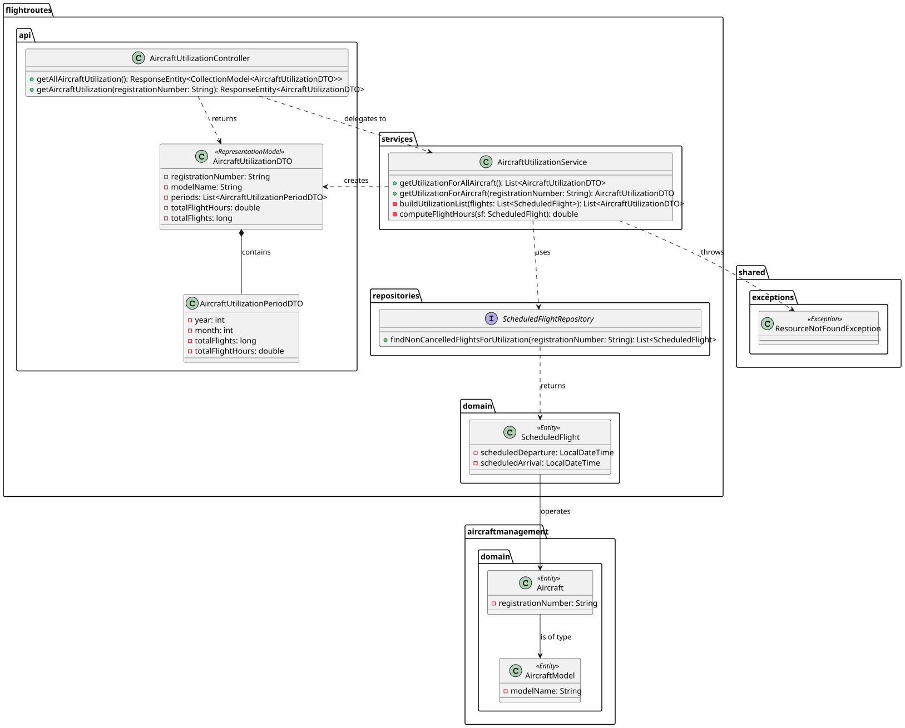

# US223 — Get Aircraft Utilization Rates Over Time

## 1. User Story

> US223 - As an Air Traffic Control Coordinator (ATCC), I want to view aircraft utilization rates over time (e.g., hours flown per month) so I can plan schedules efficiently.

## 2. Acceptance Criteria

- The system must provide an overview of utilization for all aircraft in the fleet.
- The system must allow querying the utilization of a specific aircraft using its registration number.
- Utilization must be calculated based on the total flight hours and total number of flights per month.
- Only flights that are successfully completed or scheduled (non-cancelled) should count towards utilization.
- The endpoint must return data wrapped in `CollectionModel` (HATEOAS) for the fleet overview.
- The endpoint must be secured with JWT, requiring the `ATCC` role.

## 3. Design Decisions

### Cross-Aggregate Querying Strategy
The utilization rate is fundamentally about `Aircraft` (WP1/WP2), but the data to calculate it resides entirely within the `ScheduledFlight` aggregate (WP3). To maintain aggregate isolation and avoid deep coupling, the calculation is performed inside the `flightroutes` package. The `ScheduledFlightRepository` queries the flight data, grouping it by aircraft registration number, rather than traversing from the Aircraft root down.

### In-Memory Grouping vs. Native SQL Aggregation
While native SQL `GROUP BY` queries could calculate monthly utilization, the application relies on an in-memory aggregation strategy (`LinkedHashMap` in the `AircraftUtilizationService`). This allows for cleaner Java stream processing, easier instantiation of the DTOs, and better unit testability without relying on complex JPQL/native queries, keeping the code highly maintainable.

### Time Calculation Precision
To calculate "hours flown," the service uses `ChronoUnit.MINUTES.between(departure, arrival) / 60.0`. Calculating by minutes and converting to a fractional double hour ensures a much higher degree of precision than attempting to calculate hours directly, accounting accurately for flights that last partial hours.

### Robust 404 Handling
If an ATCC requests utilization for a specific aircraft that has no flights scheduled (or a registration number that does not exist in the database), the service throws a `ResourceNotFoundException`. The `GlobalExceptionHandler` intercepts this and correctly returns a `404 Not Found`, ensuring the API adheres strictly to REST principles rather than returning an empty `200 OK`.

### HATEOAS Compliance
The DTOs (`AircraftUtilizationDTO`) extend Spring HATEOAS's `RepresentationModel`. The `AircraftUtilizationController` actively builds `CollectionModel` responses with `_embedded` lists and appropriate `self` and relational `_links`, adhering fully to the rigorous REST Level 3 requirements of the project.

## 4. Diagrams

### System Sequence Diagram

### Sequence Diagram

### Class Diagram
