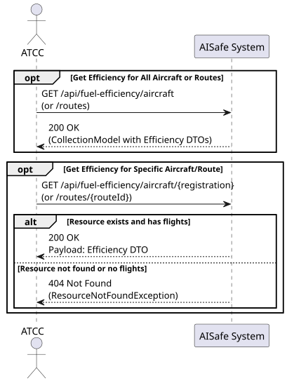
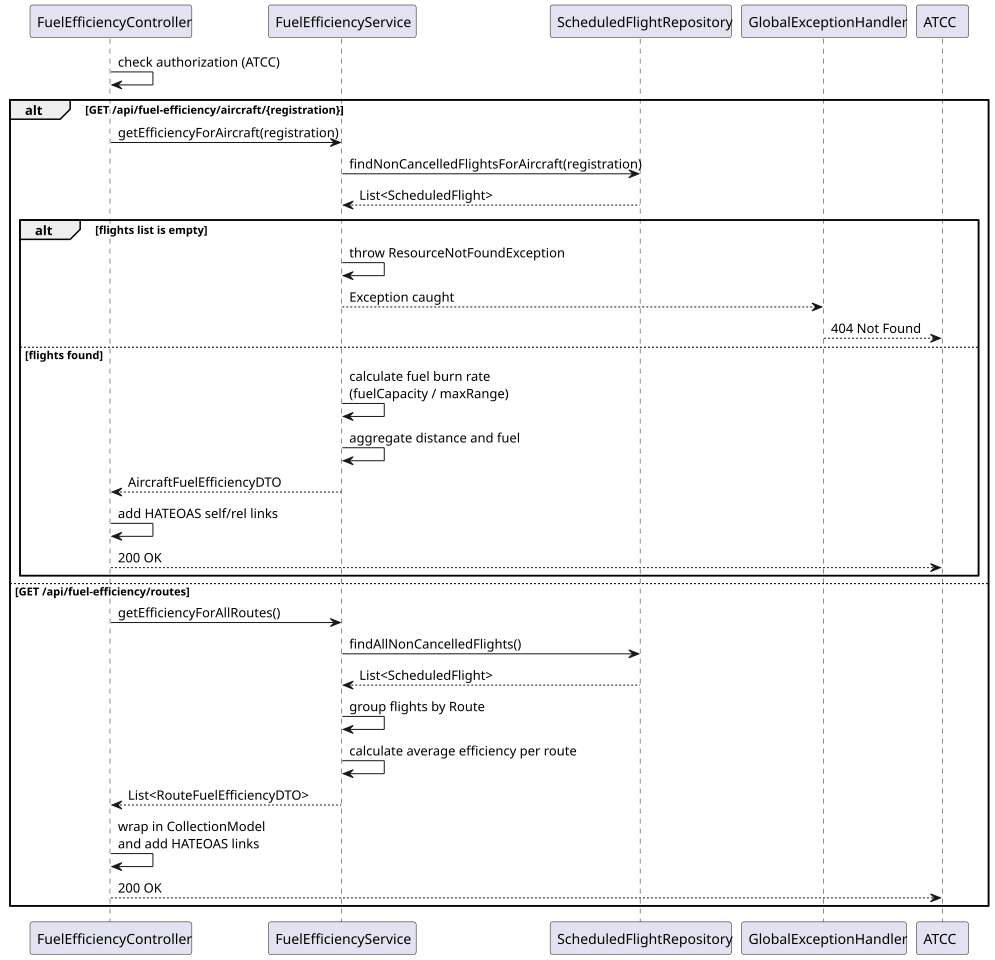
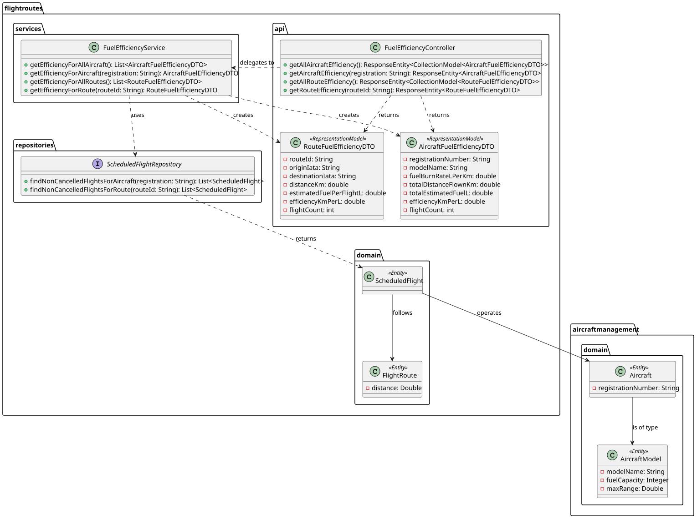

# US227 — Fuel Efficiency Metrics

## 1. User Story

> US227 - As an Air Traffic Control Coordinator (ATCC), I want to view estimated fuel consumption and efficiency metrics per aircraft and per route.

## 2. Acceptance Criteria

- The system must provide fuel efficiency metrics (e.g., km/L, total estimated fuel) for all aircraft and all flight routes.
- The system must allow querying the efficiency of a specific aircraft or a specific route using their respective identifiers.
- Only aircraft and routes that have at least one scheduled, non-cancelled flight should be included in the calculations.
- The endpoints must be secured with JWT, requiring the `ATCC` role.
- List endpoints must return data wrapped in `CollectionModel` following HATEOAS principles.
- DTO properties must strictly match the API contract (e.g., `efficiencyKmPerLiter`).

## 3. Design Decisions

### Fuel Burn Rate Approximation (Heuristic)
The system does not currently store a dedicated `fuelBurnPerKm` field in the database. As a design decision, the average fuel consumption (L/km) is dynamically derived using the formula: `AircraftModel.fuelCapacity / AircraftModel.maxRange`. This provides a realistic approximation over the model's certified maximum range. Future enhancements could introduce a dedicated field for higher accuracy, but this heuristic perfectly satisfies the current scope.

### Route-Level Efficiency Estimation
For route efficiency, fuel consumption per flight is estimated using the minimum aircraft requirement (`minRangeRequired`) as a proxy for the model that would typically operate it, combined with the route's actual distance. When multiple different aircraft models operate the same route, the burn rate is aggregated and averaged, keeping the route efficiency model-agnostic but data-driven.

### API Contract Compliance via Jackson
To align the internal Java naming conventions with the strict API integration tests (which expect the property `efficiencyKmPerLiter`), the `@JsonProperty("efficiencyKmPerLiter")` annotation was used in the DTOs. This allows the internal variables to retain concise names (like `efficiencyKmPerL`) while guaranteeing the exported JSON matches the exact external contract requirements.

### Separation of Concerns
Even though fuel efficiency involves `Aircraft`, `AircraftModel`, and `FlightRoute`, the orchestration is handled by a dedicated `FuelEfficiencyService`. This prevents bloating the existing `AircraftService` or `FlightRouteService` with cross-domain metric calculations.

## 4. Diagrams

### System Sequence Diagram

### Sequence Diagram

### Class Diagram
