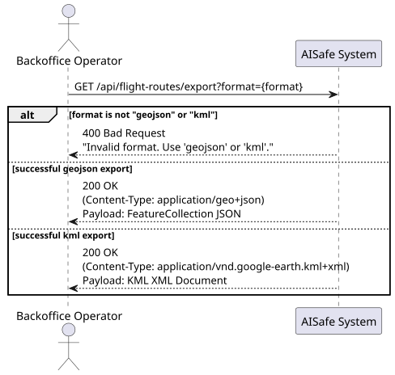
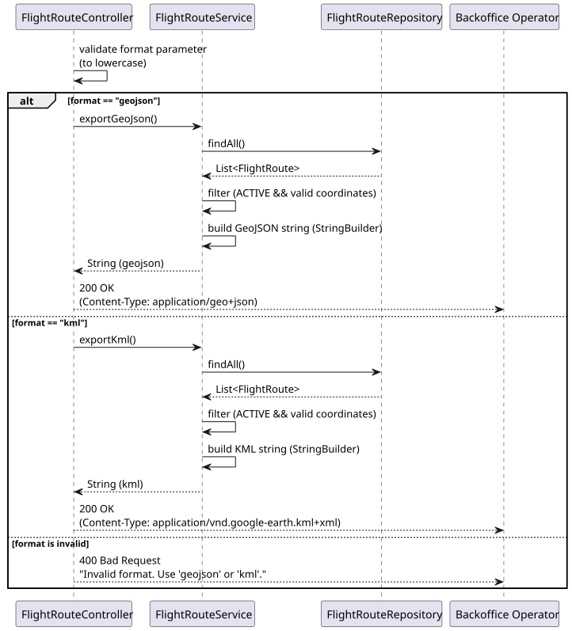
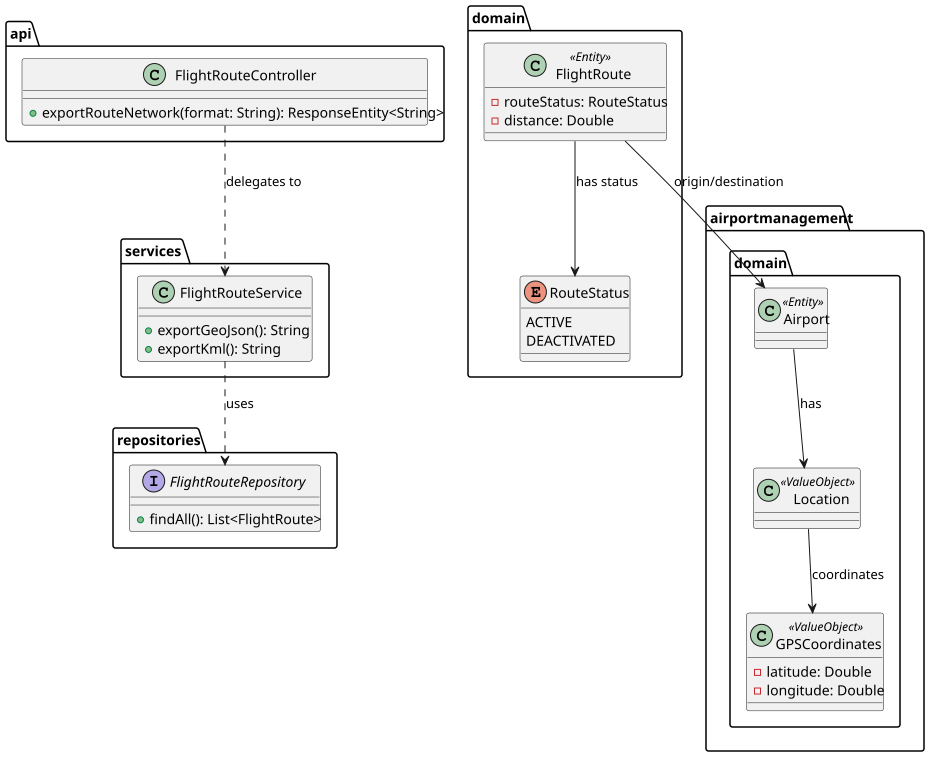

# Bonus US228 — Export Route Network Data

## 1. User Story

> US228 - As a Backoffice Operator, I want to export route network data in standard aviation formats (GeoJSON, KML).

## 2. Acceptance Criteria

- The system must allow exporting the active route network in either `GeoJSON` or `KML` format.
- Only routes with an `ACTIVE` status and valid GPS coordinates for both origin and destination should be included.
- The endpoint must be secured with JWT, requiring the `BACKOFFICE_OPERATOR` role.
- The correct HTTP `Content-Type` header must be returned based on the requested format.

## 3. Design Decisions

### Single Endpoint with Query Parameter
Instead of creating separate endpoints for each format (e.g., `/export/geojson` and `/export/kml`), a single endpoint `GET /api/flight-routes/export?format={format}` is used. A `switch` expression at the Controller level elegantly routes the request to the appropriate service method, keeping the API surface clean and easily extensible in the future.

### Lightweight String Building
Generating GeoJSON and KML heavily relies on specific document structures. Instead of adding heavy third-party mapping libraries (which would increase the project's dependency footprint for a single bonus feature), the `FlightRouteService` constructs the payloads dynamically using `StringBuilder`. This approach is highly performant and perfectly adequate for the assignment's scope.

### Coordinate Validation
The service methods actively filter out any routes where the origin or destination `GPSCoordinates` are null before appending them to the document. This defensive programming ensures that the resulting GeoJSON/KML files are structurally sound and won't crash external visualization tools (like Google Earth or Mapbox).

### Dynamic Media Types
The controller explicitly sets the `Content-Type` header (`application/geo+json` for GeoJSON and `application/vnd.google-earth.kml+xml` for KML). This ensures that web browsers or API clients (like Postman) recognize the file type immediately and can prompt the user to download or render the file correctly.

## 4. Diagrams

### System Sequence Diagram

### Sequence Diagram

### Class Diagram
