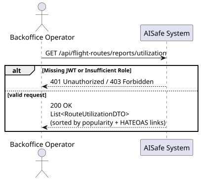
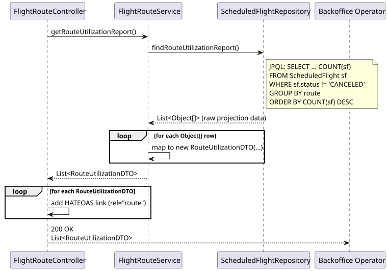
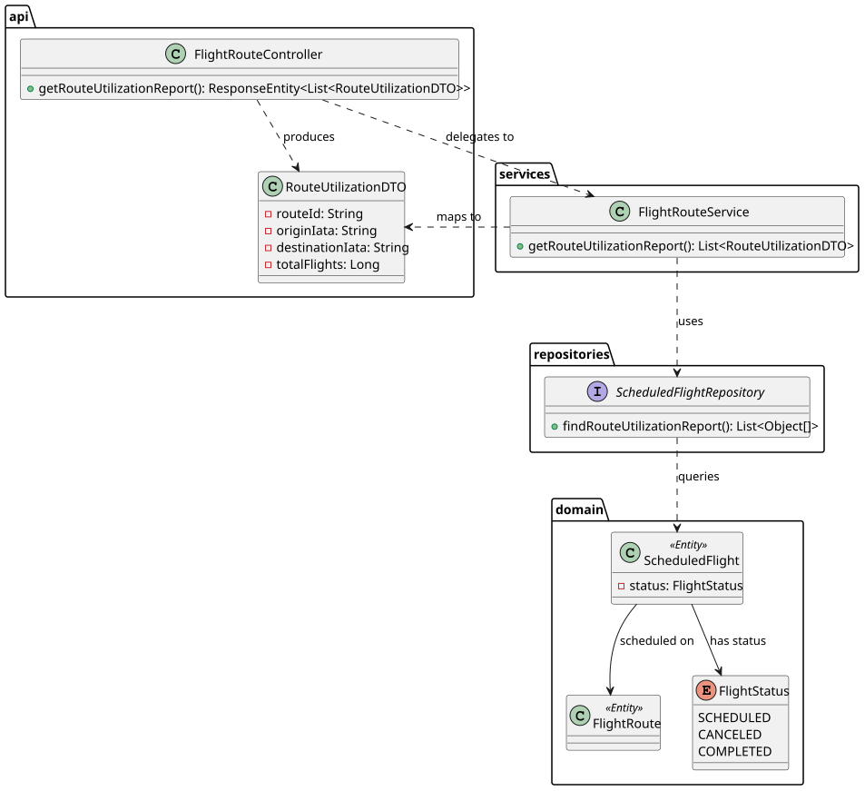

# Bonus US229 — Flight Utilization Report

## 1. User Story

> US229 - As a Backoffice Operator, I want to generate flight utilization reports showing which routes are most frequently flown.

## 2. Acceptance Criteria

- The system must generate a ranked report of routes based on the number of scheduled flights.
- Canceled flights must not be counted in the utilization report.
- The endpoint must be secured with JWT, requiring the `BACKOFFICE_OPERATOR` role.
- The response must include HATEOAS links allowing the user to navigate to the full details of each route.

## 3. Design Decisions

### Database-Level Aggregation and Projection
To ensure high performance and low memory footprint, the utilization report is generated entirely at the database layer. The `ScheduledFlightRepository` uses a custom JPQL query with `GROUP BY` and `ORDER BY COUNT(sf) DESC`. Instead of hydrating full `ScheduledFlight` and `FlightRoute` entities, the query projects directly into a lightweight `List<Object[]>`, which the service then maps to the `RouteUtilizationDTO`.

### Exclusion of Canceled Flights
The query explicitly filters records using `WHERE sf.status != 'CANCELED'`. This business rule ensures that the utilization statistics reflect real operational intent (flights that are `SCHEDULED` or `COMPLETED`) and are not skewed by canceled operations.

### Controller-Level HATEOAS Enrichment
Since `RouteUtilizationDTO` is an aggregate projection rather than a core domain entity, it does not have a dedicated ModelAssembler. Instead, the `FlightRouteController` iterates over the generated report and dynamically appends a HATEOAS link (with the relation `route`) to each entry, allowing the client to easily fetch the full details of the route directly via the US113 endpoint.

## 4. Diagrams

### System Sequence Diagram

### Sequence Diagram

### Class Diagram
