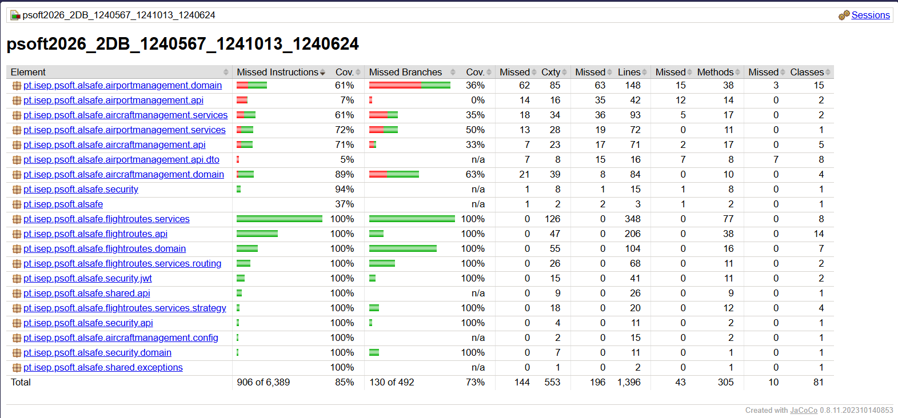

# Quality Assurance — Test Coverage & Strategy

This document outlines the testing strategy and coverage metrics for the AISafe system, ensuring the reliability and correctness of the implemented business rules.

## 1. Testing Strategy

The project employs a multi-layered testing approach to guarantee software quality:

* **Unit Testing (JUnit 5 & Mockito):** Focused on ensuring that the Domain entities (Aggregate Roots, Value Objects) strictly enforce their invariants (e.g., preventing a canceled flight from being canceled again). The Service layer is also thoroughly tested using Mockito to isolate database dependencies and verify business orchestration (e.g., overlapping flight validations).
* **Automated API Testing (Postman):** Following the RESTful design requirements, all endpoints are covered by automated integration tests using Postman scripts (`pm.test`). These tests validate HTTP status codes (200, 201, 400, 404, 409), the structure of the JSON responses, and the presence of HATEOAS links. The complete collection is available in the `docs/postman` directory.

## 2. Test Coverage Report (JaCoCo)

A comprehensive coverage report was generated using the JaCoCo plugin after executing the unit test suite. The team prioritized high coverage in the core domain and service layers.

### Summary
- **Overall instruction coverage:** 83% (901/5315)
- **Branch coverage:** 71% (130/458)
- **Flight Routes Work Package (WP#3):** 100% instruction and branch coverage achieved across `domain`, `services`, `api`, and `routing` packages.

