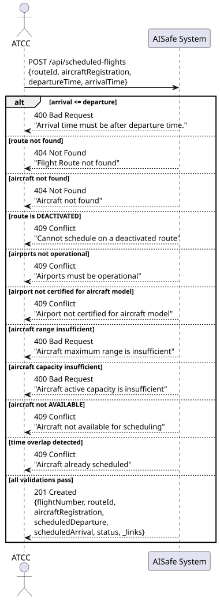
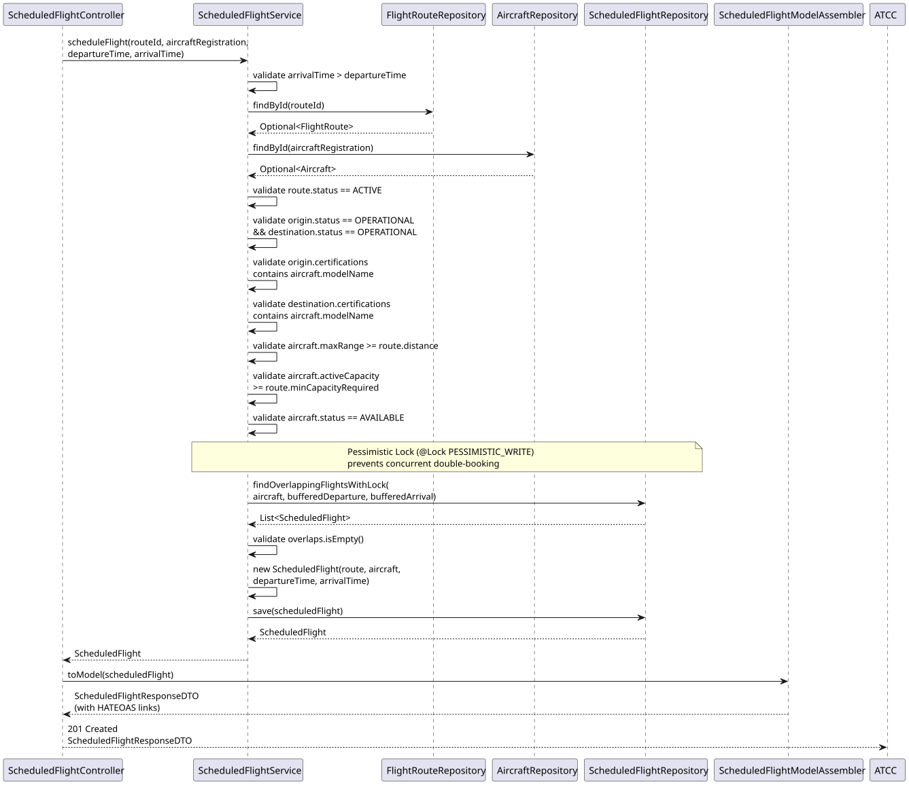
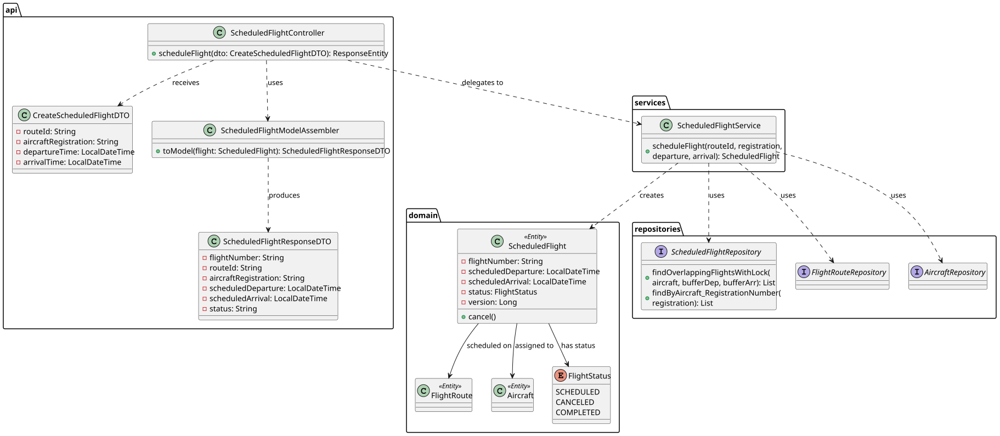

# US212 — Schedule a Flight

## 1. User Story

> As an ATCC, I want to assign an aircraft to a route for a specific date and time
> to create a scheduled flight. These should comply with range requirements,
> airplane and airport availability.

## 2. Acceptance Criteria

- The route must exist and be ACTIVE.
- The aircraft must exist and be AVAILABLE.
- Both origin and destination airports must be OPERATIONAL.
- Both airports must hold a certification for the aircraft model.
- The aircraft's maximum range must be >= the route's distance.
- The aircraft's active capacity must be >= the route's minimum capacity requirement.
- Arrival time must be after departure time.
- The aircraft must have no overlapping SCHEDULED flights (with a 30-minute buffer).
- On success, returns 201 Created with HATEOAS links.

## 3. Design Decisions

### Pessimistic Locking for concurrency control
The overlap check uses `@Lock(LockModeType.PESSIMISTIC_WRITE)` on the repository query.
This prevents two concurrent requests from booking the same aircraft for the same time
window — a race condition that optimistic locking cannot reliably prevent, since both
reads would succeed before either write.

### 30-minute turnaround buffer
The overlap window is extended by 30 minutes on each side (`TURNAROUND_BUFFER_MINUTES`).
This ensures realistic ground time between consecutive flights for the same aircraft
(boarding, refuelling, cleaning), preventing back-to-back assignments with zero gap.

### Validation order
Validations follow a fail-fast sequence from cheapest to most expensive:
time consistency → route exists → aircraft exists → route active →
airports operational → certifications → range → capacity → status → overlap (DB lock).
The DB lock is always last to minimise lock contention.

### HATEOAS links
The response includes a `self` link and an `all-aircraft-flights` link,
allowing clients to navigate directly to the aircraft's full schedule.

## 4. Diagrams

### System Sequence Diagram

### Sequence Diagram

### Class Diagram
