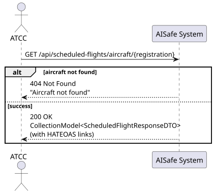
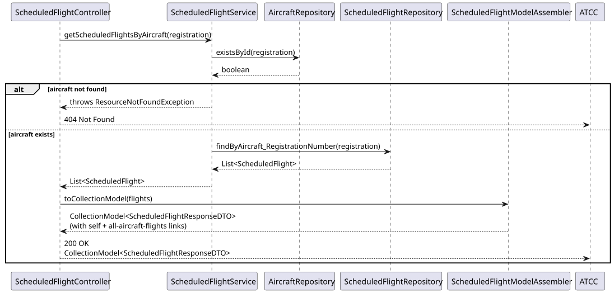
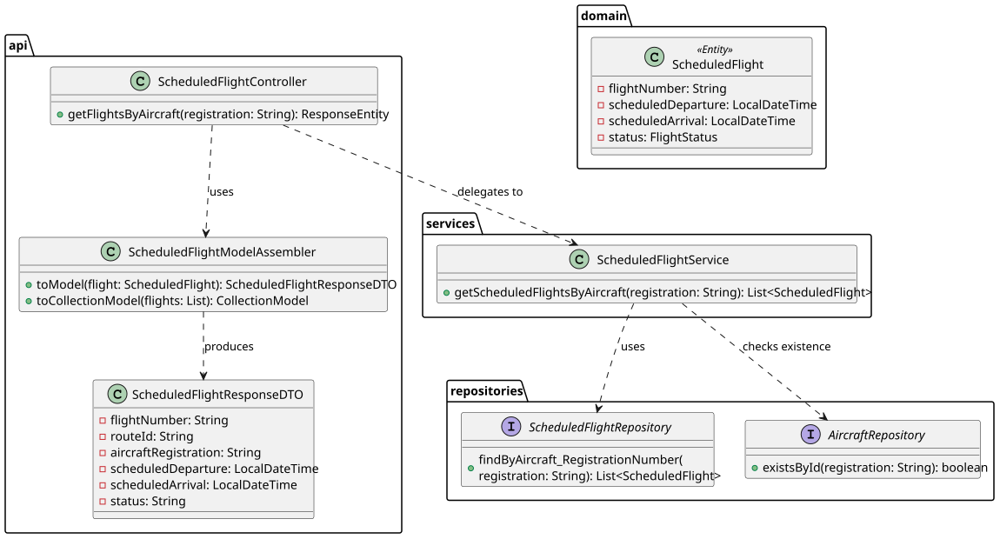

# US213 — View Scheduled Flights for a Specific Aircraft

## 1. User Story

> As an ATCC, I want to view all scheduled flights for a specific aircraft.

## 2. Acceptance Criteria

- The aircraft must exist — otherwise 404 Not Found is returned.
- Returns all scheduled flights associated with the given aircraft registration,
  regardless of status (SCHEDULED, CANCELED, COMPLETED).
- Response includes HATEOAS links for navigation.
- Requires ATCC role (JWT).

## 3. Design Decisions

### Existence check before query
The service checks `existsById` before querying flights, producing a clear
404 response when the aircraft does not exist — rather than returning an
empty list that the client could misinterpret as "no flights scheduled".

### HATEOAS collection response
The response wraps the list in a `CollectionModel` with a `self` link
pointing to the collection endpoint, and each item carries its own `self`
and `all-aircraft-flights` links inherited from the assembler defined in US212.

### Additional endpoint (beyond requirements)
A `GET /api/scheduled-flights/{flightNumber}` endpoint was also implemented
to retrieve a single scheduled flight by its number. This was not required
by US213 but was necessary to support the HATEOAS `self` links produced
by the US212 response. It is documented separately in the
[Bonus — Get Flight By Id](../Bonus/GetFlightById/) folder.

## 4. Diagrams

### System Sequence Diagram

### Sequence Diagram

### Class Diagram
