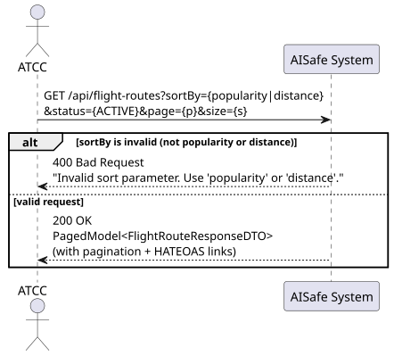
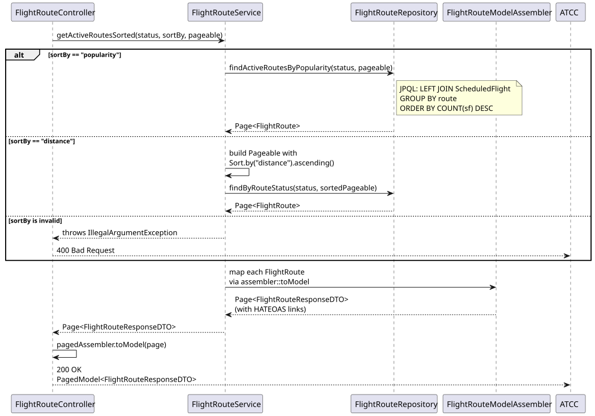
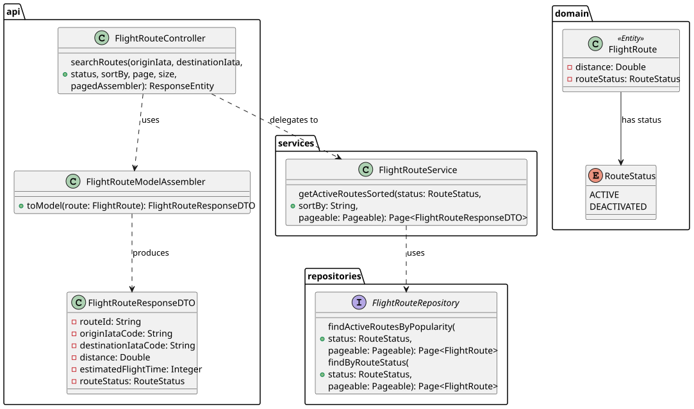

# US214 — List Active Routes Sorted

## 1. User Story

> As an ATCC, I want to list all active routes sorted by popularity
> (number of times used) or distance.

## 2. Acceptance Criteria

- `sortBy` must be either `popularity` or `distance` — otherwise 400 Bad Request.
- Only routes with status `ACTIVE` are returned (default if `status` not provided).
- Results are paginated.
- Response includes HATEOAS links for each route and pagination metadata.
- Requires ATCC role (JWT).

## 3. Design Decisions

### Shared endpoint with US114
US214 is served by the same `GET /api/flight-routes` endpoint as US114.
The presence of the `sortBy` query parameter determines which branch executes:
- `sortBy` present → US214 (sorted active routes)
- `sortBy` absent → US114 (search by origin/destination filters)

This avoids endpoint proliferation while keeping the two use cases clearly
separated at the service layer.

### Two distinct sorting strategies
**Popularity** uses a JPQL query with `LEFT JOIN ScheduledFlight ... GROUP BY route
ORDER BY COUNT(sf) DESC`. The join is left-join so routes with zero scheduled
flights still appear in the result, ranked last.

**Distance** uses Spring Data's `Sort` mechanism (`Sort.by("distance").ascending()`)
applied to the existing `findByRouteStatus` query, avoiding a second custom JPQL
query for a trivial sort.

### Status defaults to ACTIVE
If the client omits the `status` parameter, the service defaults to `RouteStatus.ACTIVE`.
This matches the intent of the user story and avoids returning deactivated routes
unless explicitly requested.

## 4. Diagrams

### System Sequence Diagram

### Sequence Diagram

### Class Diagram
