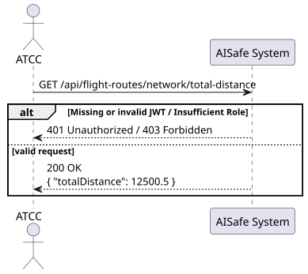
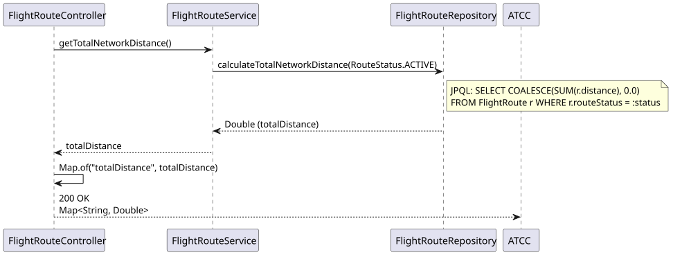
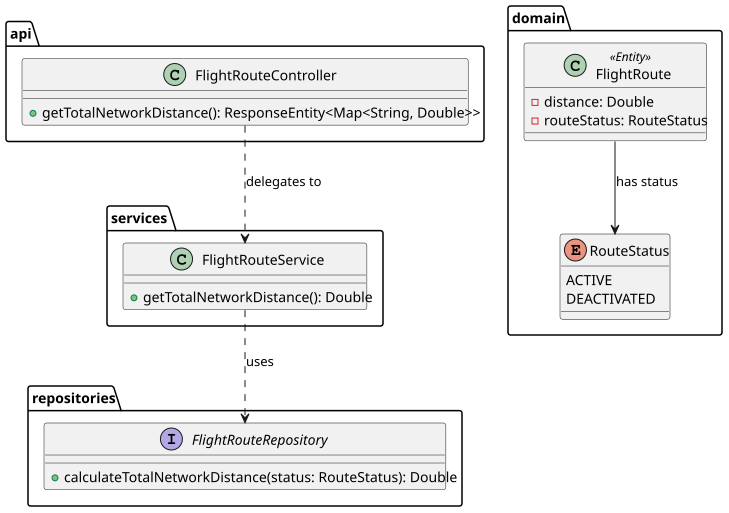

# US215 — Calculate Total Network Distance

## 1. User Story

> As an ATCC, I want to calculate the total distance covered by all routes in my network.

## 2. Acceptance Criteria

- The calculation must only include flight routes with an `ACTIVE` status.
- The endpoint must return the total sum of the distances.
- Requires authentication and the `ATCC` role via JWT token.

## 3. Design Decisions

### Database-Level Aggregation (JPQL)
To optimize performance and minimize memory consumption, the sum of the distances is calculated directly at the database level rather than fetching all route entities into the application's memory. This is achieved using the JPQL query: `SELECT COALESCE(SUM(r.distance), 0.0) FROM FlightRoute r WHERE r.routeStatus = :status`.

### Null-Safety with COALESCE
The `COALESCE` function is used within the query to ensure that if there are no active routes in the system, the query safely returns `0.0` instead of `null`. This prevents potential `NullPointerException`s at the service layer and guarantees a consistent numeric response.

### Lightweight Response Structure
Since the requirement is to return a single scalar value, the controller wraps the `Double` result in a standard Java `Map<String, Double>` (which Spring automatically serializes to a simple JSON object: `{"totalDistance": value}`). This keeps the endpoint lightweight, straightforward to consume, and avoids the overhead of creating a dedicated DTO for a single field.

## 4. Diagrams

### System Sequence Diagram

### Sequence Diagram

### Class Diagram
