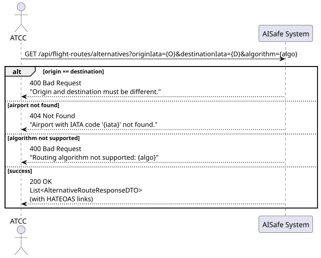
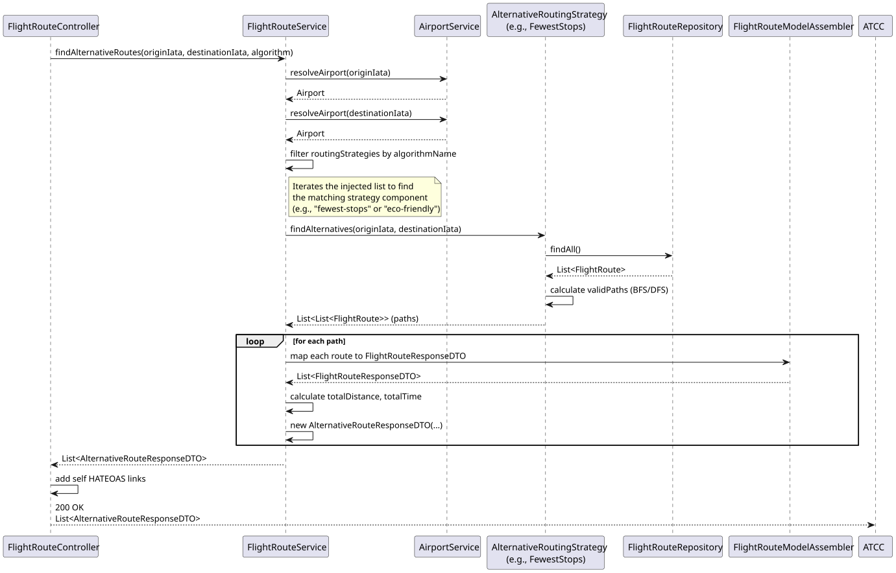
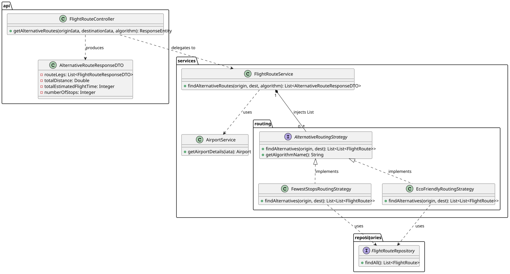

# US216 — Search for Alternative Routes

## 1. User Story

> As an ATCC, I want to search for alternative routes between two airports.

## 2. Acceptance Criteria

- The system must find multi-leg flight paths connecting an origin and a destination airport.
- Both origin and destination airports must exist and be different.
- The endpoints must be secured with JWT, requiring the `ATCC` role.
- The response must include HATEOAS links.

## 3. Design Decisions

### Strategy Pattern for Routing Algorithms
To calculate alternative routes, the system implements the **Strategy Design Pattern** via the `AlternativeRoutingStrategy` interface. The `FlightRouteService` injects a `List<AlternativeRoutingStrategy>` containing all available Spring components implementing this interface. 
This approach strictly adheres to the **Open/Closed Principle (OCP)**: new routing algorithms can be plugged into the system simply by adding a new class, without modifying the core service logic.

The client dynamically selects the desired algorithm via the `algorithm` query parameter (defaulting to `fewest-stops`).

### Algorithm 1: Fewest Stops (Default)
Implemented by `FewestStopsRoutingStrategy`. 
- **Approach:** Uses a **Breadth-First Search (BFS)** algorithm to traverse the active flight network.
- **Goal:** Finds combinations with the minimum number of layovers. It limits the search depth to 3 legs to maintain performance and avoid overly complex flight paths. It also includes cycle detection to prevent infinite loops (e.g., A -> B -> A).

### Algorithm 2: Eco-Friendly (Bonus/Extended)
Implemented by `EcoFriendlyRoutingStrategy`.
- **Approach:** Uses a **Depth-First Search (DFS)** algorithm.
- **Goal:** Finds paths connecting the two airports and sorts them by the lowest total accumulated distance, returning the top 3 most efficient paths. This is ideal for minimizing fuel consumption. 

### Separation of Concerns in DTOs
The service aggregates the discovered `FlightRoute` entities into an `AlternativeRouteResponseDTO`. This DTO automatically calculates the `totalDistance`, `totalEstimatedFlightTime`, and `numberOfStops` for each alternative path, providing a rich, client-ready response.

## 4. Diagrams

### System Sequence Diagram

### Sequence Diagram

### Class Diagram
