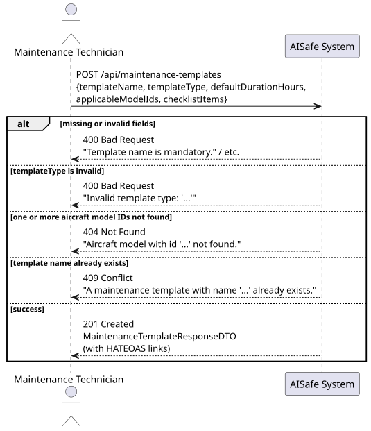
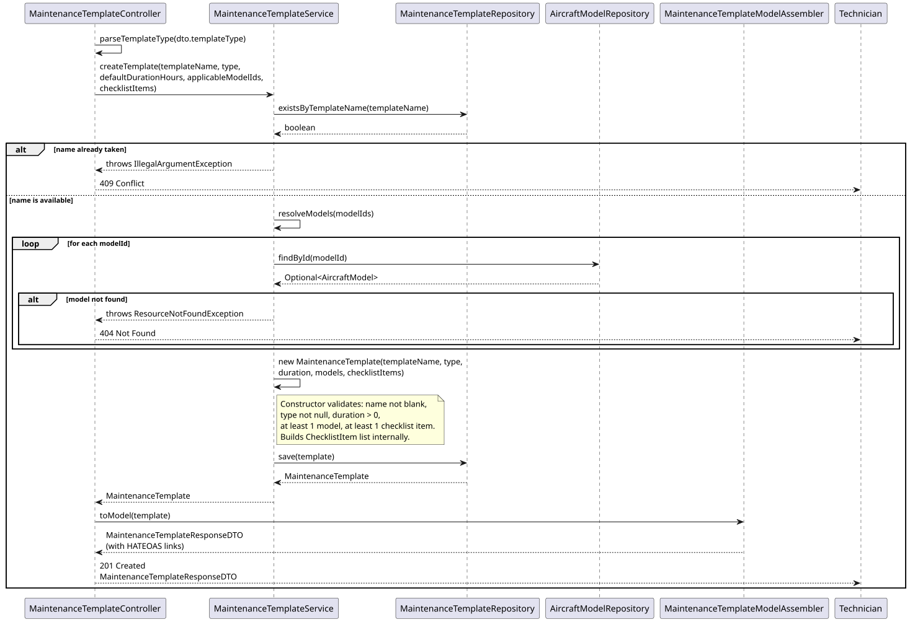
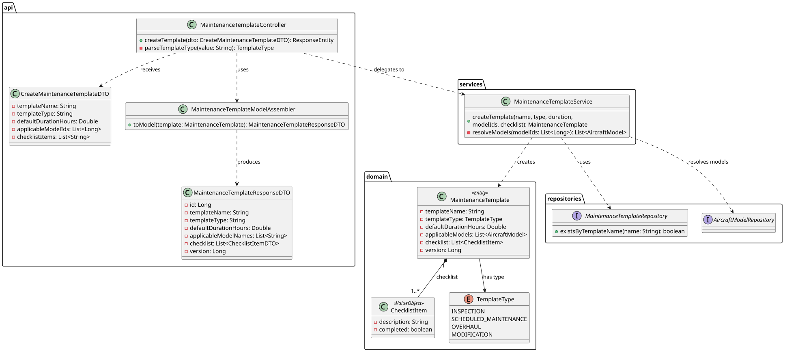

# US115A — Create Maintenance Template

## 1. User Story

> As a Maintenance Technician, I want to create maintenance templates with details
> including template name, template type (inspection, scheduled maintenance,
> overhaul, modification), applicable aircraft models, and checklist.

## 2. Acceptance Criteria

- `templateName` must be unique across all templates — otherwise 409 Conflict.
- `templateType` must be one of: INSPECTION, SCHEDULED_MAINTENANCE, OVERHAUL, MODIFICATION.
- `defaultDurationHours` must be strictly positive.
- At least one applicable aircraft model must be specified — all model IDs must exist.
- At least one checklist item must be specified — items cannot be blank.
- Requires MAINTENANCE_TECHNICIAN role (JWT).
- On success, returns 201 Created with HATEOAS links.

## 3. Design Decisions

### Service enforces uniqueness, domain enforces shape
The `MaintenanceTemplate` constructor validates structural rules (non-blank name,
positive duration, non-empty model/checklist lists) — these are invariants the
entity can check by itself. Name **uniqueness**, however, is a cross-aggregate
concern (it requires querying the repository), so it is enforced at the service
layer before construction, keeping the domain model free of repository dependencies.

### Checklist is template-owned, record-owned copies are independent
The template holds the *master* checklist. When a `MaintenanceRecord` is created
from a template (US115B), `cloneChecklist()` produces a deep copy of `ChecklistItem`s
so that ticking off a task on one maintenance record never mutates the template
used by future records.

### Partial update with optimistic locking (US-adjacent)
Although not required by US115A directly, the `updateTemplate` method (used later)
follows the same optimistic locking pattern as `AircraftModelService`, requiring
the client to supply the current `version` to detect concurrent modifications.

## 4. Diagrams

### System Sequence Diagram

### Sequence Diagram

### Class Diagram
