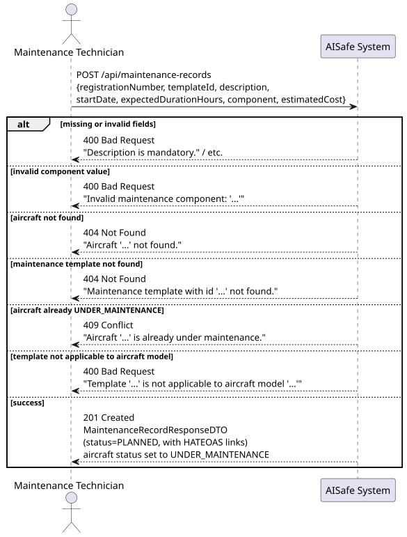
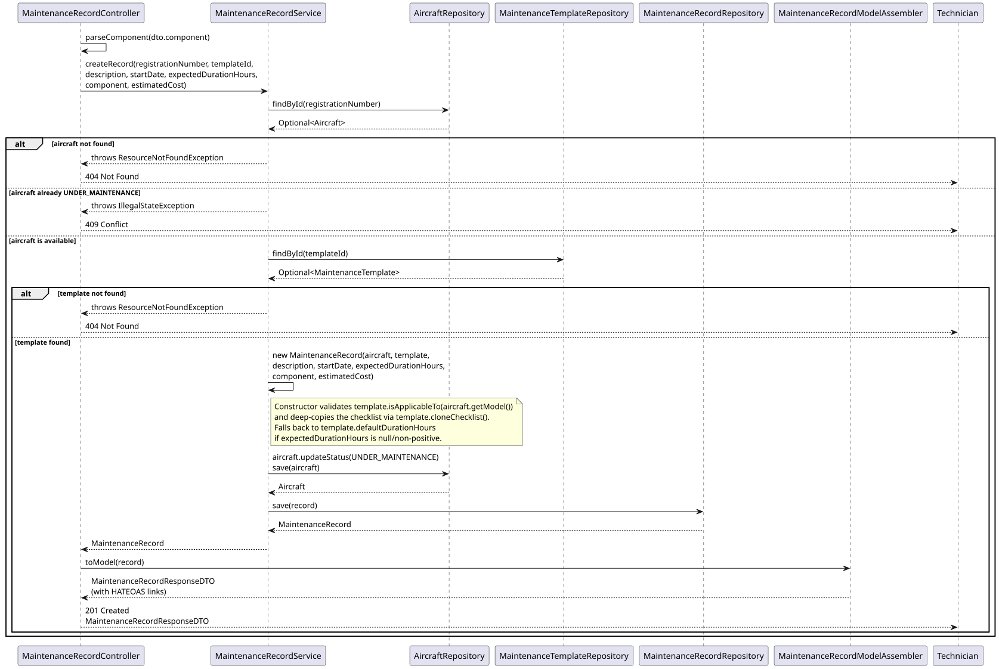
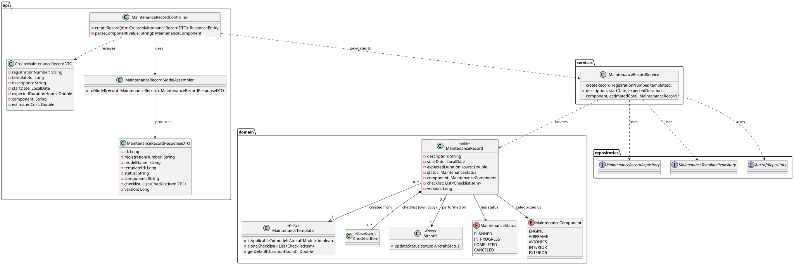

# US115B — Create Maintenance Record

## 1. User Story

> As a Maintenance Technician, I want to create a maintenance record for an
> aircraft by specifying the aircraft registration, maintenance type (according
> to a maintenance template), description, start date, expected duration and
> its checklist (defined by the maintenance template).

## 2. Acceptance Criteria

- The aircraft must exist and not already be `UNDER_MAINTENANCE`.
- The maintenance template must exist and be applicable to the aircraft's model.
- `description`, `startDate`, and `component` are mandatory.
- `expectedDurationHours` is optional — falls back to the template's default if
  omitted or non-positive.
- `estimatedCost`, if provided, cannot be negative.
- On creation, the record's checklist is an independent deep copy of the
  template's checklist, and the aircraft's status is set to `UNDER_MAINTENANCE`.
- Requires MAINTENANCE_TECHNICIAN role (JWT).
- On success, returns 201 Created with HATEOAS links.

## 3. Design Decisions

### Template-aircraft compatibility check
The constructor validates `template.isApplicableTo(aircraft.getModel())` before
allowing the record to be created. This prevents, for example, using an
"Engine Overhaul — Boeing 737" template on an Airbus A320, catching a
data-entry mistake at the earliest possible point.

### Checklist deep copy via `cloneChecklist()`
Rather than referencing the template's checklist directly, the constructor calls
`template.cloneChecklist()`, which returns brand-new `ChecklistItem` value objects.
This guarantees that marking an item as done on this record (`completeChecklistItem`)
never mutates the reusable template — each maintenance record has its own
independent progress tracking.

### Aircraft availability side-effect
Creating a record is not a pure read-then-write of the `MaintenanceRecord`
aggregate — it also transitions the related `Aircraft` to `UNDER_MAINTENANCE`.
This mirrors the assignment's operational constraint: *"Aircraft under
maintenance cannot be assigned to flights."* The service explicitly guards
against creating a second concurrent record for an aircraft already under
maintenance, returning 409 Conflict rather than silently allowing it.

### Duration fallback strategy
If the technician doesn't specify `expectedDurationHours` (or supplies an
invalid non-positive value), the constructor falls back to the template's
`defaultDurationHours`. This keeps the API ergonomic — most maintenance jobs
of a given type take roughly the same time — while still allowing technicians
to override the estimate for unusual cases.

## 4. Diagrams

### System Sequence Diagram

### Sequence Diagram

### Class Diagram
