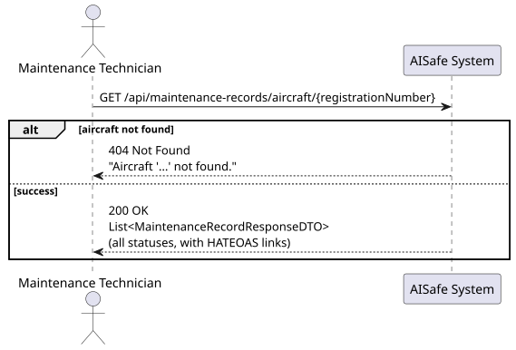
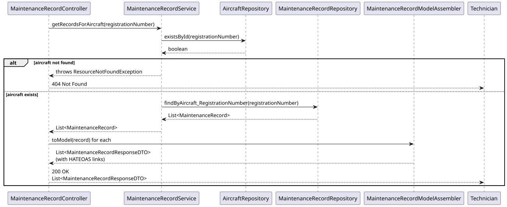
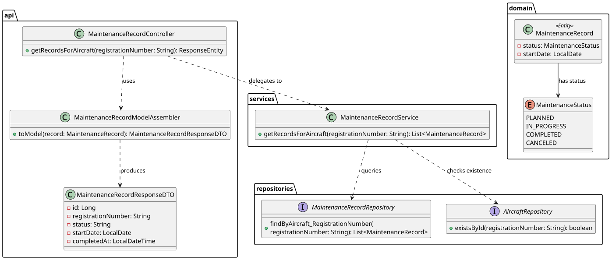

# US116 — View Maintenance Records for a Specific Aircraft

## 1. User Story

> As a Maintenance Technician, I want to view all maintenance records for a
> specific aircraft.

## 2. Acceptance Criteria

- The aircraft must exist — otherwise 404 Not Found is returned.
- Returns the complete maintenance history for the aircraft, in **all** statuses
  (PLANNED, IN_PROGRESS, COMPLETED, CANCELED) — no implicit filtering.
- Each record's response includes its checklist and HATEOAS links.
- Accessible by MAINTENANCE_TECHNICIAN, MAINTENANCE_SUPERVISOR, and ATCC roles.

## 3. Design Decisions

### Existence check before query
Mirroring the pattern already established in US213 (`ScheduledFlightService`),
the service checks `aircraftRepository.existsById(...)` before querying records.
This produces a clear 404 when the aircraft is unknown, rather than an
ambiguous empty list that the client could misread as "aircraft exists but
has no maintenance history".

### No status filtering at this endpoint
US116 intentionally returns records in every status. Filtering by status,
date range, or component is a separate, more flexible concern handled by the
dedicated search endpoint (US218). Keeping US116 simple and unfiltered avoids
overloading a single endpoint with query parameters that aren't part of this
user story's scope.

### Derived query method
`findByAircraft_RegistrationNumber` is a Spring Data derived query navigating
through the `Aircraft` relationship. No custom JPQL is needed since the
filter is a direct equality match on a single foreign key.

## 4. Diagrams

### System Sequence Diagram

### Sequence Diagram

### Class Diagram
