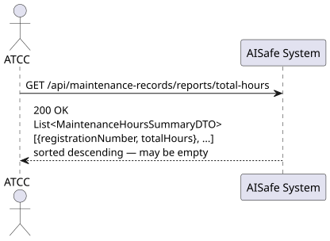
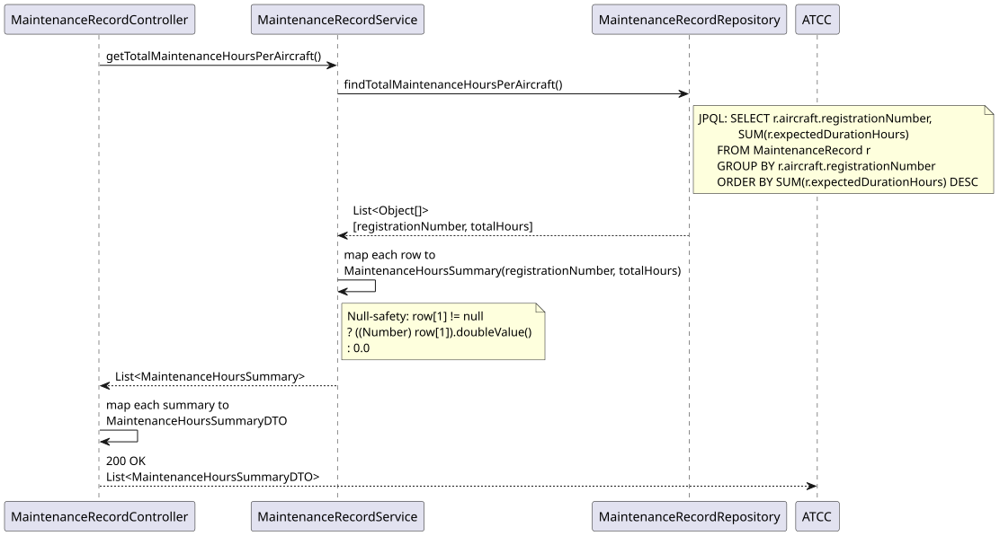
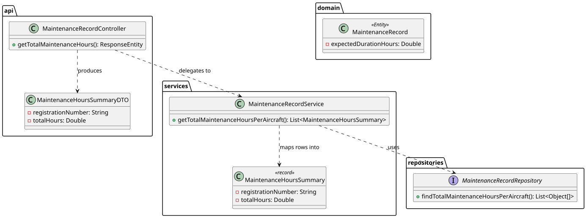

# US117 — View Total Maintenance Hours for Fleet

## 1. User Story

> As an ATCC, I want to view the total number of maintenance hours for
> aircraft in my fleet.

## 2. Acceptance Criteria

- Returns the sum of **expected** maintenance hours per aircraft, aggregated
  across all of its maintenance records (any status).
- Results are sorted by total hours, descending.
- Returns an empty list if no maintenance records exist yet.
- Requires ATCC role (JWT).

## 3. Design Decisions

### Database-level aggregation (JPQL `GROUP BY`/`SUM`)
Following the same pattern established in US215 (`calculateTotalNetworkDistance`),
the aggregation happens entirely at the database level via JPQL `GROUP BY` and
`SUM`, rather than fetching every `MaintenanceRecord` into memory and summing
in Java. This scales correctly as the maintenance history grows into the
thousands of records mentioned in the assignment's scale requirements.

### Sums `expectedDurationHours`, not `actualDurationHours`
This metric reports **planned workload** per aircraft — useful for forecasting
fleet maintenance capacity — rather than historical actual time spent (which
is only available for `COMPLETED` records and is covered separately by US221's
turnaround report). Using `expectedDurationHours` means the total is available
immediately when a record is created, not only after completion.

### Plain `Object[]` projection mapped to a Java `record`
Rather than a dedicated `@Entity` projection or interface-based DTO projection,
the repository returns `List<Object[]>`, and the service maps each row into a
lightweight `MaintenanceHoursSummary` Java `record`. This keeps the repository
query simple and avoids creating a throwaway JPA projection interface for a
two-column aggregate result.

### Null-safety on the aggregate
If an aircraft somehow has records with a null `expectedDurationHours` sum
(not possible given the domain's `> 0` invariant, but defensive nonetheless),
the service falls back to `0.0` rather than propagating a `NullPointerException`
to the API layer.

## 4. Diagrams

### System Sequence Diagram

### Sequence Diagram

### Class Diagram
