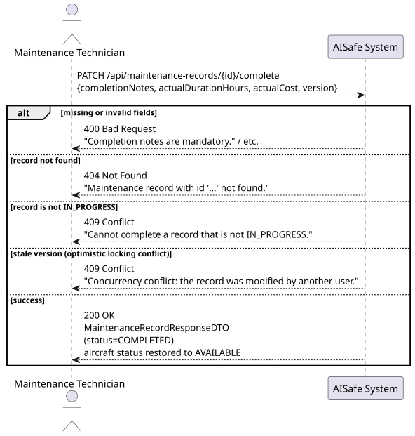
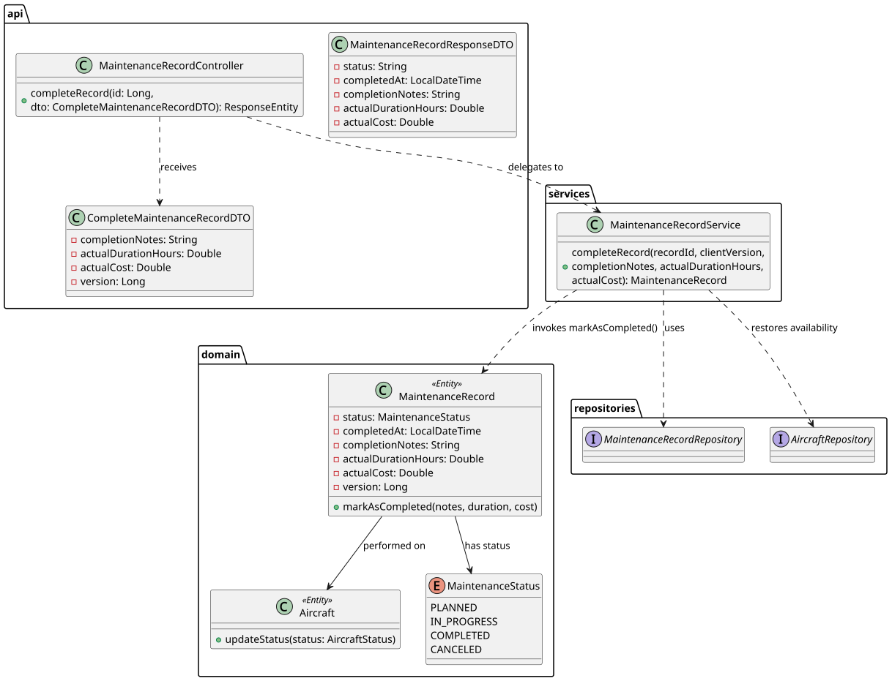

# US119 — Mark Maintenance Record as Completed

## 1. User Story

> As a Maintenance Technician, I want to update a maintenance record to mark
> it as completed and add completion notes.

## 2. Acceptance Criteria

- The record must exist and be in status `IN_PROGRESS` — otherwise 409 Conflict.
- `completionNotes` and `actualDurationHours` are mandatory; `actualDurationHours`
  must be strictly positive.
- `actualCost`, if provided, cannot be negative.
- The client must supply the current `version` for optimistic locking —
  a stale version returns 409 Conflict.
- On success, the aircraft's status is restored to `AVAILABLE`.
- Requires MAINTENANCE_TECHNICIAN role (JWT).

## 3. Design Decisions

### Strict state machine — only `IN_PROGRESS → COMPLETED`
A record cannot jump straight from `PLANNED` to `COMPLETED`. It must first
transition through `startWork()` (`PLANNED → IN_PROGRESS`). This mirrors a
real maintenance workflow: work cannot be "finished" before it has formally
started, and the two-step transition gives the system a reliable timestamp
for when work actually began versus when it was merely scheduled.

### Optimistic locking via explicit version comparison
Rather than relying solely on JPA's automatic `@Version` check at flush time,
the service explicitly compares `record.getVersion().equals(clientVersion)`
*before* calling the domain method. This produces an early, predictable
`ObjectOptimisticLockingFailureException` with a clear error message via the
`GlobalExceptionHandler`, rather than surfacing a raw JPA exception deep in
the persistence layer — the same pattern used in `FlightRouteService.updateRoute`.

### Aircraft availability side-effect mirrors creation
Just as `createRecord` sets the aircraft to `UNDER_MAINTENANCE` (US115B),
`completeRecord` is responsible for the inverse transition back to `AVAILABLE`.
Keeping this symmetry in the service layer (rather than scattering it across
multiple call sites) ensures the aircraft's operational state is always
consistent with whether it currently has an open maintenance record.

### Domain method validates business invariants, not orchestration
`markAsCompleted` on the entity only knows about *its own* state transition
rules (status, notes, durations, cost). It has no knowledge of the `Aircraft`
or its `AVAILABLE`/`UNDER_MAINTENANCE` status — that orchestration step
correctly lives in the service layer, keeping the `MaintenanceRecord` aggregate
focused on its own consistency boundary.

## 4. Diagrams

### System Sequence Diagram

### Sequence Diagram

### Class Diagram
