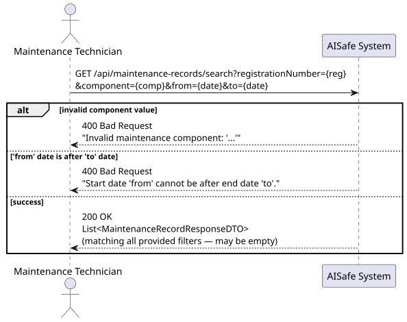
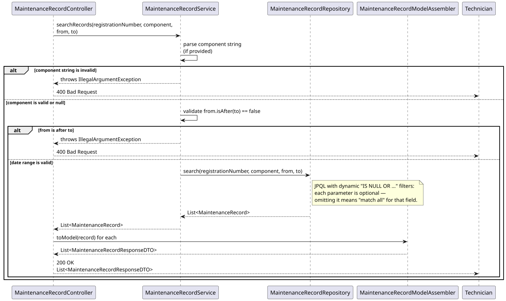
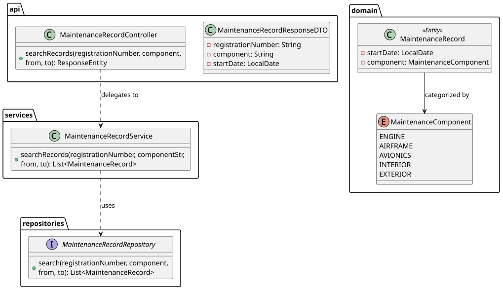

# US218 — Search Maintenance Records

## 1. User Story

> As a Maintenance Technician, I want to search maintenance records by
> aircraft, date range, or maintenance component.

## 2. Acceptance Criteria

- All filters are optional: `registrationNumber`, `component`, `from`, `to`.
- Omitting a filter means "match all" for that dimension — filters can be
  combined freely (e.g. aircraft + component, or just a date range).
- `component`, if provided, must be a valid `MaintenanceComponent` value.
- If both `from` and `to` are provided, `from` cannot be after `to`.
- Dates are ISO-8601 (`yyyy-MM-dd`).
- Accessible by MAINTENANCE_TECHNICIAN, MAINTENANCE_SUPERVISOR, and ATCC roles.

## 3. Design Decisions

### Single dynamic JPQL query over multiple specialized methods
Rather than writing a combinatorial explosion of derived query methods
(`findByAircraftAndComponent`, `findByAircraftAndDateRange`, etc.), the
repository uses one JPQL query with an `IS NULL OR ...` pattern per parameter:

```sql
WHERE (:registrationNumber IS NULL OR r.aircraft.registrationNumber = :registrationNumber)
  AND (:component        IS NULL OR r.component = :component)
  AND (:from             IS NULL OR r.startDate >= :from)
  AND (:to               IS NULL OR r.startDate <= :to)
```

This scales cleanly as more optional filters are added in the future, at the
cost of the database having to evaluate a few extra `IS NULL` checks per row
— a negligible cost given JPQL's parameter binding and the expected dataset size.

### Validation lives in the service, not the repository
The repository query is purely mechanical — it has no opinion on whether
`component` is a real enum value or whether `from`/`to` form a sane range.
Both validations happen in `MaintenanceRecordService.searchRecords` before
the query executes, so a malformed request never reaches the database layer
and always returns a clear 400 with an actionable message.

### Case-insensitive component parsing
The component query parameter is parsed with `.toUpperCase()` before calling
`MaintenanceComponent.valueOf(...)`, so `component=engine` and
`component=ENGINE` both resolve correctly — consistent with how
`MaintenanceRecordController.parseComponent` already behaves for record creation.

## 4. Diagrams

### System Sequence Diagram


### Sequence Diagram


### Class Diagram
