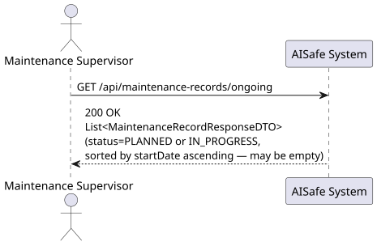
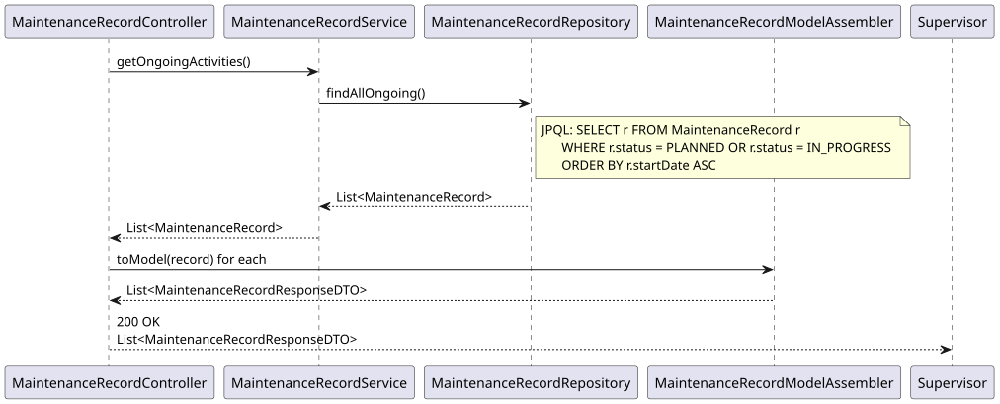
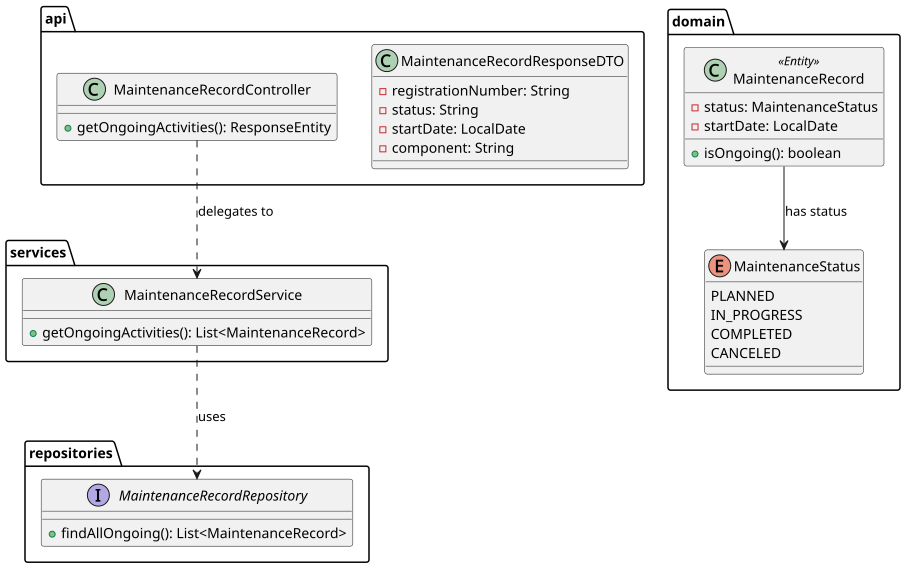

# US219 — View All Ongoing Maintenance Activities

## 1. User Story

> As a Maintenance Supervisor, I want to view all ongoing maintenance
> activities across the fleet.

## 2. Acceptance Criteria

- Returns all maintenance records currently in status `PLANNED` or
  `IN_PROGRESS` — i.e. work that has not yet been completed or canceled.
- Results are sorted by `startDate` ascending, so the supervisor sees the
  longest-running or soonest-due activities first.
- Returns an empty list if no maintenance is currently ongoing.
- Requires MAINTENANCE_SUPERVISOR role (JWT).

## 3. Design Decisions

### Fleet-wide, no aircraft filter
Unlike US116 (records for *one* aircraft) or US218 (flexible multi-filter
search), US219 deliberately has **no parameters**. It exists to give the
Maintenance Supervisor a single, unfiltered, fleet-wide snapshot — the kind
of dashboard view a supervisor checks first thing to understand current
workload across the entire fleet, without first having to know which
aircraft to look at.

### "Ongoing" defined at the query level, mirrored in the domain
The repository's `findAllOngoing()` hardcodes the `PLANNED`/`IN_PROGRESS`
status filter directly in JPQL. The domain entity also exposes an equivalent
`isOngoing()` convenience method (`status == PLANNED || status == IN_PROGRESS`)
for use elsewhere in the codebase (e.g. business rule checks), keeping the
definition of "ongoing" consistent between the query layer and the domain
layer rather than letting two independent definitions drift apart over time.

### Role restricted to Maintenance Supervisor
Unlike most other maintenance read endpoints (open to Technician, Supervisor,
and ATCC), this fleet-wide oversight view is restricted to
`MAINTENANCE_SUPERVISOR` only — reflecting its role as a supervisory/oversight
tool rather than a day-to-day technician task.

## 4. Diagrams

### System Sequence Diagram

### Sequence Diagram

### Class Diagram
