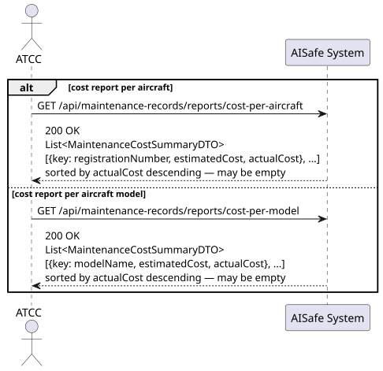
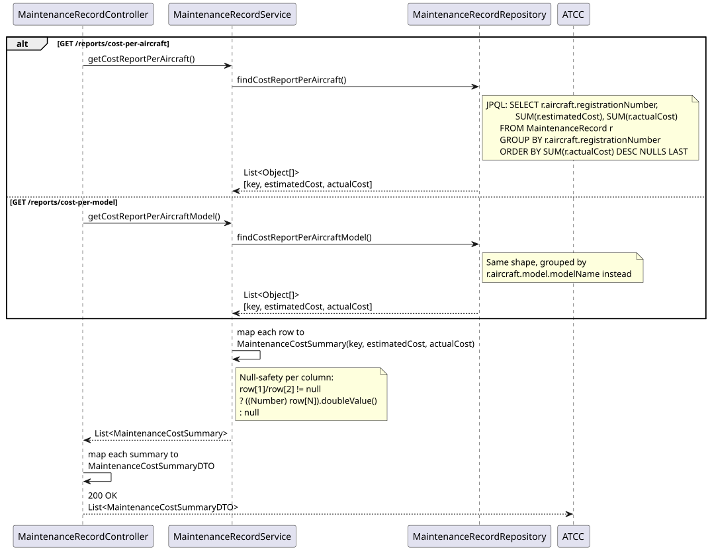
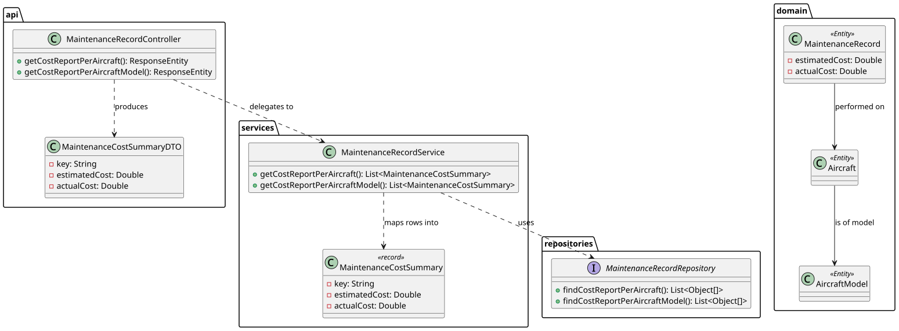

# US220 — Generate Maintenance Cost Reports

## 1. User Story

> As an ATCC, I want to generate reports on maintenance costs per aircraft
> or per aircraft model.

## 2. Acceptance Criteria

- Two distinct report endpoints, both with the same response shape:
  - `GET /reports/cost-per-aircraft` — costs aggregated by aircraft registration.
  - `GET /reports/cost-per-model` — costs aggregated by aircraft model name.
- Each entry reports both `estimatedCost` (planned, set at record creation)
  and `actualCost` (final, set on completion) — these may differ.
- Sorted by `actualCost` descending; entries with no actual cost yet
  (e.g. records still in progress) sort last.
- Returns an empty list if no maintenance records exist.
- Requires ATCC role (JWT).

## 3. Design Decisions

### Two parallel queries instead of one parameterized query
Unlike US218's single dynamic query, cost reporting uses **two separate**
JPQL queries — one grouping by `r.aircraft.registrationNumber`, the other by
`r.aircraft.model.modelName`. This is intentional: the `GROUP BY` target
itself changes between the two reports, which isn't expressible as an
optional `IS NULL OR ...` filter the way US218's row-level filters are.
Two small, readable queries are clearer here than one query with a
dynamically-chosen grouping column (which JPQL cannot easily parameterize).

### Generic `key` field instead of separate DTOs
`MaintenanceCostSummaryDTO` uses a generic `key` field rather than
`registrationNumber` or `modelName` specifically. Since both reports return
an identical shape (`key`, `estimatedCost`, `actualCost`) and differ only in
*what* the key represents, reusing one DTO avoids near-duplicate classes that
would only differ by a field name — the API documentation on each endpoint
clarifies what `key` means in that context.

### `SUM(...) DESC NULLS LAST`
Aircraft with maintenance still in progress have `actualCost = null` for
those records, which can make the aggregated `SUM` itself `null` for that
aircraft if *all* its records lack an actual cost. `NULLS LAST` ensures these
incomplete-data rows sort to the bottom rather than unpredictably interleaving
with aircraft that do have a final cost — keeping the most actionable
(cost-confirmed) rows at the top.

### Estimated vs. actual cost as separate, independently nullable columns
Carrying both `estimatedCost` and `actualCost` through the same row (rather
than only reporting one) lets the ATCC immediately compare planned vs. real
spend per aircraft or model — a budget variance check — without needing to
cross-reference two separate report calls.

## 4. Diagrams

### System Sequence Diagram

### Sequence Diagram

### Class Diagram
