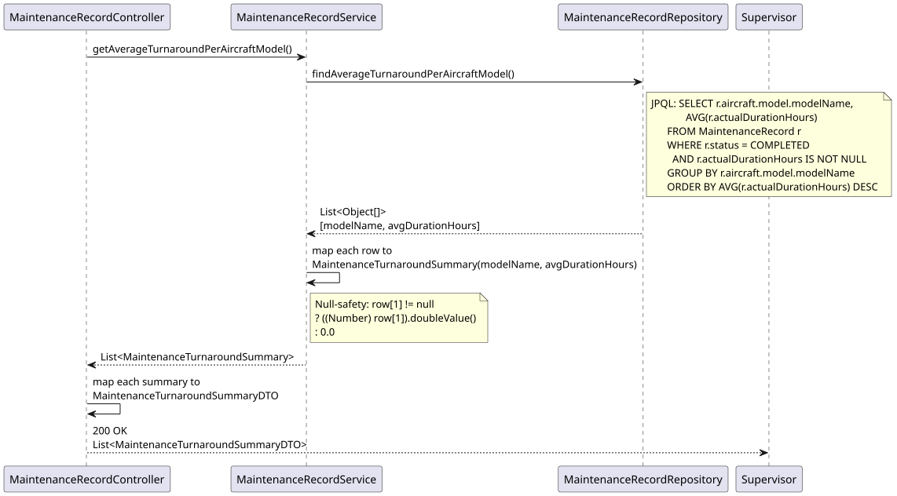
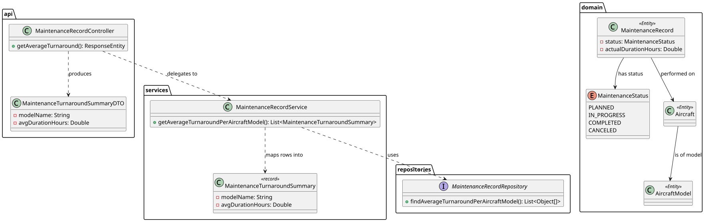

# US221 — Average Maintenance Turnaround Time per Aircraft Type

## 1. User Story

> As a Maintenance Supervisor, I want to view average maintenance turnaround
> time per aircraft type.

## 2. Acceptance Criteria

- Returns the average **actual** maintenance duration (in hours), grouped by
  aircraft model name (the "aircraft type").
- Only `COMPLETED` records contribute to the average — planned, in-progress,
  and canceled records are excluded, since they have no reliable actual
  duration figure.
- Sorted by average duration descending — the slowest-to-turn-around aircraft
  types appear first.
- Returns an empty list if no records have been completed yet.
- Requires MAINTENANCE_SUPERVISOR role (JWT).

## 3. Design Decisions

### `AVG` over `actualDurationHours`, never `expectedDurationHours`
This is the key distinction from US117's hours report. US117 sums **planned**
workload (`expectedDurationHours`, available the moment a record is created).
US221 measures **real-world performance** — how long maintenance actually
took — which is only meaningful once work is finished. Mixing the two would
produce a misleading metric, so the query explicitly filters
`status = COMPLETED AND actualDurationHours IS NOT NULL`.

### Grouped by aircraft *model*, not by individual aircraft
"Aircraft type" in the user story maps directly to `AircraftModel`, not to a
specific tail number. This makes the metric meaningful at a fleet-planning
level — e.g. "Boeing 737s average 8.2h per maintenance visit, A320s average
6.5h" — informing decisions like fleet composition or technician scheduling,
rather than ranking individual aircraft (which US220's cost report already does).

### Double filter for data quality (`status` + `actualDurationHours IS NOT NULL`)
Although the domain's `markAsCompleted()` constructor logic *requires*
`actualDurationHours` to be set before a record can become `COMPLETED`
(enforced in `MaintenanceRecord.markAsCompleted`), the query keeps the
explicit `IS NOT NULL` check as a defensive safeguard. This protects the
average from being skewed by `null`, should the invariant ever be relaxed or
data be migrated from another source in the future.

## 4. Diagrams

### System Sequence Diagram

### Sequence Diagram

### Class Diagram
