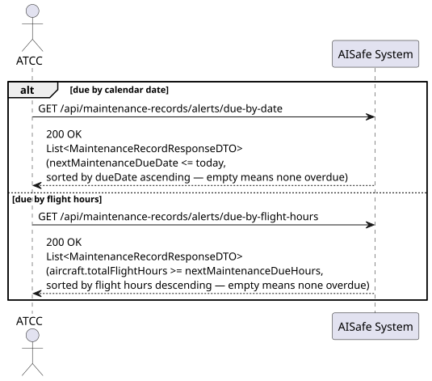
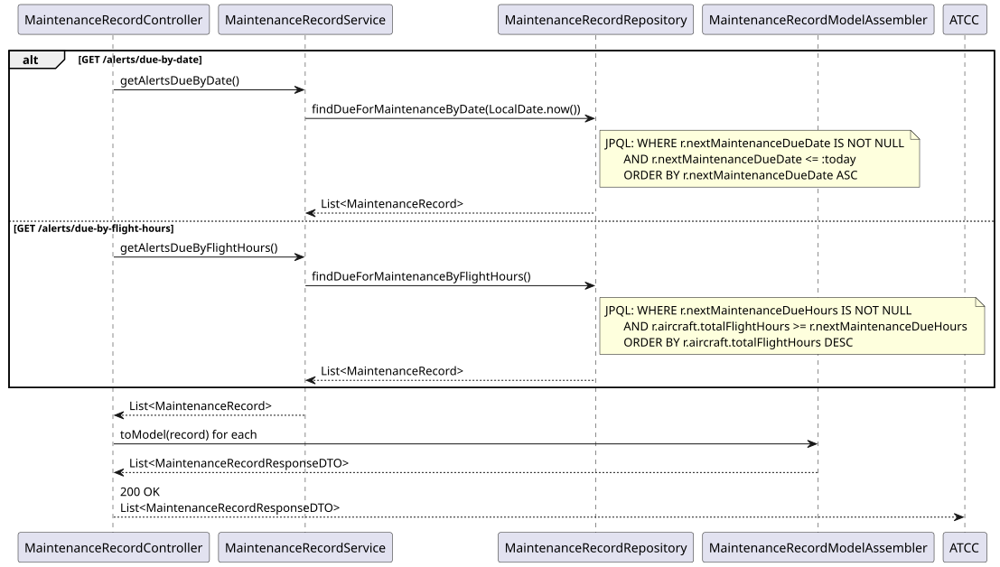
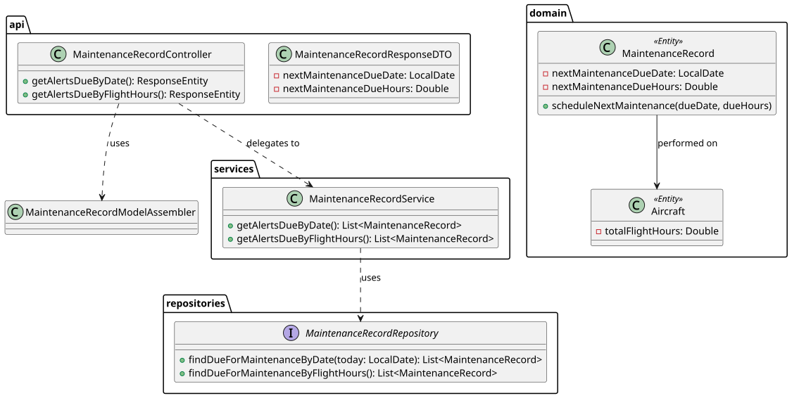

# US222 — Receive Scheduled Maintenance Alerts

## 1. User Story

> As an ATCC, I want to receive alerts when aircraft are due for scheduled
> maintenance based on flight hours or calendar days.

## 2. Acceptance Criteria

- Two independent alert endpoints, both returning the same response shape:
  - `GET /alerts/due-by-date` — records whose `nextMaintenanceDueDate` is
    today or earlier (overdue or due today).
  - `GET /alerts/due-by-flight-hours` — records whose aircraft has
    accumulated flight hours at or beyond `nextMaintenanceDueHours`.
- `due-by-date` results are sorted ascending by due date (most overdue first).
- `due-by-flight-hours` results are sorted descending by total flight hours
  (most overdue first, by a different measure).
- An empty list means no aircraft are currently due by that criterion.
- Requires ATCC role (JWT).

## 3. Design Decisions

### Threshold fields are optional and set on-demand
`nextMaintenanceDueDate` and `nextMaintenanceDueHours` are nullable columns
on `MaintenanceRecord`, populated via the dedicated `scheduleNextMaintenance(...)`
domain method rather than at construction time. A maintenance record doesn't
necessarily know its *next* due threshold the moment it's created — that's
typically decided once the current work is assessed (e.g. "next oil change
due in 500 flight hours or 6 months, whichever comes first"). Keeping these
fields separate from the main creation flow avoids forcing every record to
specify a next-due threshold it may not yet have.

### Two independent alert dimensions, not one combined query
Calendar-based and flight-hour-based maintenance triggers are genuinely
different operational signals — a "due by date" alert reflects a fixed
inspection interval, while "due by flight hours" reflects actual wear. The
assignment's `scheduled maintenance based on flight hours or calendar days`
phrasing ("or") confirms these should be checked independently rather than
combined into one query with an OR-condition that would conflate two very
different urgency signals into a single, less actionable list.

### Each alert method validates only its own threshold field
`findDueForMaintenanceByDate` filters `nextMaintenanceDueDate IS NOT NULL`,
and `findDueForMaintenanceByFlightHours` filters `nextMaintenanceDueHours
IS NOT NULL` — independently. A record that only has a date threshold set
(and no hours threshold) correctly appears only in the date-based alert list,
and vice versa, without one query accidentally surfacing records that aren't
actually being tracked by that dimension.

### Comparison against the aircraft's live cumulative flight hours
`findDueForMaintenanceByFlightHours` joins through to
`r.aircraft.totalFlightHours` — the aircraft's running total, updated
elsewhere in the system (e.g. via `Aircraft.addFlightHours(...)` after
completed flights in WP#3). This means the alert is always evaluated against
the aircraft's *current* cumulative hours at query time, not a stale snapshot
taken when the maintenance record was created.

## 4. Diagrams

### System Sequence Diagram

### Sequence Diagram

### Class Diagram
